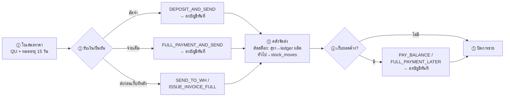

# Insep ERP — โฟลว์การทำงานใหม่ (Flow Redesign v1.0)

> เอกสารเสริมของ `00_MIGRATION_PLAN_v1.md` — ใช้คู่กันตอน implement (Phase 2-4)
> **หลักการ**: ฟังก์ชันเดิมครบทุกตัว + สูตรคำนวณเดิมเป๊ะทุกจุด (section 6 ของแผนหลักยังศักดิ์สิทธิ์) — สิ่งที่เปลี่ยนคือ **การจัดวางหน้าจอ, เส้นทางการทำงาน, และเจ้าของข้อมูล** เพื่อตัดความวกวนที่เกิดจากข้อจำกัด "3 spreadsheet แยกกัน" ซึ่งไม่มีอีกแล้ว

---

## 1. ทำไมระบบเดิมวกวน (วินิจฉัยจากโค้ดจริง)

ระบบเดิมแบ่ง "ตามแอป" เพราะข้อจำกัดทางเทคนิค (1 แอป = 1 spreadsheet = 1 GAS deployment) ไม่ใช่เพราะเป็นเส้นทางการทำงานที่ดี ผลคือ **ข้อมูลก้อนเดียวกันมีเจ้าของ 2 ที่** และผู้ใช้ต้องกระโดดข้ามแอปกลางงาน:

| # | จุดทับซ้อน | อาการวกวน |
|---|---|---|
| T1 | **ลูกค้า 2 ตาราง**: `custdata` (ขาย) กับ `Contacts` (บัญชี) | เพิ่มลูกค้าในแอปขาย → webhook ไป auto-create contact ฝั่งบัญชีด้วยการเดาจากชื่อ (normalize trim/lowercase) — ชื่อพิมพ์ต่างกันนิดเดียว = คู่ค้าซ้ำ, แก้ที่อยู่ต้องแก้ 2 ที่ |
| T2 | **ลูกหนี้ 2 ระบบ**: `outstandingBalance` + สถานะออเดอร์ (ขาย) กับ AP/AR `apArStatus` (บัญชี) | ยอดค้างจากออเดอร์ขายไม่โผล่ในหน้า "ลูกหนี้" ของบัญชี — เจ้าของกิจการต้องเปิด 2 แอปถึงเห็นภาพลูกหนี้ครบ |
| T3 | **สต็อก 2 ระบบ + อ่านข้ามแอป**: `Stock_Product` (ผลิต, สุรา) กับ `curstock`/`stockmove` (ขาย, ทั่วไป) | หน้าคลังแอปขายเห็นสต็อกตัวเอง แต่สต็อกสุราต้องอ่านข้าม spreadsheet + cache 60 วิ + ตัดผ่าน webhook — สต็อกที่เห็นอาจไม่สด และมี 2 หน้าจอสต็อกคนละแอป |
| T4 | **เมนูขายเป็นตาราง mapping ลอย**: `menu_b2b` (ชื่อเมนู → productId × multiplier) | เพิ่มสินค้าใหม่ต้องทำ 2 ที่ (Master_Product ฝั่งผลิต + menu_b2b ฝั่งขาย) แล้วต้องพิมพ์ productId ให้ตรงเอง |
| T5 | **รายรับจากขายคำนวณฝั่งขายแล้ว "ส่งไป" บัญชี** ผ่านคิว + trigger 1 นาที | เกิดสถานะกลาง "รอ sync / failed" ที่ผู้ใช้ต้องคอยเฝ้าหน้าคิว — เป็น overhead ที่มีเพราะ network ล้วน ๆ |
| T6 | **ต้นทุนสุรา → วัตถุดิบ ผูกกันด้วย "ชื่อพิมพ์ตรงเป๊ะ"**: บัญชีกรอกชื่อ item ต้อง match `Master_Material['ชื่อวัตถุดิบ']` | พิมพ์เพี้ยนตัวเดียว = ยิงไม่ผ่าน ได้ toast เหลือง แล้วต้องไปกรอกฝั่งผลิตเองซ้ำ |
| T7 | **รายงานราชการกระจาย 2 แอป**: ภส.๐๗ อยู่ผลิต, ภพ.30/ภงด./50ทวิ อยู่บัญชี | ทุกเดือนคนเดียวกันยื่นทุกใบ แต่ต้องไล่เปิดทีละแอปทีละแท็บ ไม่มีที่เดียวที่บอกว่า "เดือนนี้ต้องสร้างอะไรบ้าง สร้างครบยัง" |
| T8 | **ข้อมูลบริษัท/กิจการกระจาย**: Script Properties 3 ชุด + ชีท Entities | แก้ที่อยู่บริษัท = แก้ 3 ที่ |

## 2. หลักการออกแบบใหม่: จาก "3 แอป" → "ข้อมูลชุดเดียว + 4 พื้นที่ทำงาน"

```
                    ┌─────────────────────────────────────────┐
                    │        Supabase (ข้อมูลชุดเดียว)          │
                    │  contacts · products+หน่วยขาย · entities │
                    │  log_* (ledger สรรพสามิต) · transactions │
                    │  sales_orders · stock (2 ledger, 1 view) │
                    └─────────────────────────────────────────┘
                       ▲            ▲            ▲          ▲
   workspace:      🏭 ผลิต       🛒 ขาย       📒 บัญชี    📄 รายงานราชการ
   (มุมมองงาน)   batch-centric  order-timeline  เงินเข้า-ออก  รวมทุกฟอร์ม/เดือน
```

กติกาใหม่ 3 ข้อ:

1. **ข้อมูลทุกก้อนมีเจ้าของเดียว** — workspace อื่น "อ่าน" หรือ "เรียกใช้ฟังก์ชันของเจ้าของ" ห้าม copy เก็บเอง
2. **เหตุการณ์เดียวจบใน transaction เดียว** — รับเงิน 1 ครั้ง = อัปเดตออเดอร์ + ลงบัญชี + (ถ้าจัดส่ง) ตัดสต็อก พร้อมกัน ไม่มีสถานะ "รอ sync"
3. **จัดหน้าตามเส้นทางงานจริง** (journey) ไม่ใช่ตามตาราง log — ฟอร์มกรอกยังเป็นชุดเดิม แต่ navigation พาไปเอง

### ตารางเจ้าของข้อมูล (แก้ T1-T8)

| ข้อมูล | เจ้าของใหม่ | ใครใช้อีก (อ่าน/เรียก) | แก้จุดทับซ้อน |
|---|---|---|---|
| คู่ค้า/ลูกค้า → **`contacts` ตารางเดียว** (เพิ่มฟิลด์ฝั่งขาย: phone, email, credit_term, sale_name, is_export + `roles text[]` เช่น {ลูกค้า,ผู้ขาย}) | บัญชี+ขายร่วมกัน (ฟอร์มเดียว) | ทุก workspace | **T1** — เลิก auto-create จาก webhook, แก้ครั้งเดียวเห็นทุกที่ |
| สินค้าสุรา `products` + **หน่วยขายผูกในหน้าเดียวกัน** (`sale_menu` ยังเป็นตารางเดิม แต่ UI จัดการอยู่ใต้หน้าสินค้า — เพิ่มสินค้า = ตั้งหน่วยขาย/ราคาที่เดียวจบ) | ผลิต (ตัวสินค้า) + ขาย (ราคา/หน่วยขาย) ในหน้าเดียว | ขาย, รายงาน | **T4** |
| วัตถุดิบ `materials` | ผลิต | บัญชี (dropdown ตอนบันทึกต้นทุนสุรา) | **T6** — เลิกพิมพ์ชื่อ match เอง |
| สต็อกสุรา (ledger สรรพสามิต `log_product` + `stock_product`) | ผลิต | ขาย/คลังเห็นสด + ตัดผ่าน RPC `fn_sell_product` | **T3** — realtime ไม่มี cache |
| สต็อกทั่วไป (`warehouse_stock` + `stock_moves`) | คลัง (ขาย) | — | **T3** — UI รวมเป็นหน้าสต็อกเดียว 2 ledger |
| ออเดอร์ + ยอดค้างออเดอร์ (`sales_orders`) | ขาย | บัญชี (หน้า AR แสดง read-only union) | **T2** — เห็นลูกหนี้ครบในที่เดียว ไม่คีย์ซ้ำ |
| เงินเข้า-ออกจริง (`transactions`) | บัญชี | ขายเรียก `recordRevenue()` ฟังก์ชันกลาง (สูตร S1 เดิม) | **T5** — insert ตรง ไม่มีคิว |
| เลขเอกสารขาย QU/ORD/INV/TAX | ขาย | บัญชีอ้างอิง (taxInvoiceNo) | คงเดิม (ถูกแล้ว) |
| ข้อมูลกิจการ (`entities` + excise_id) | บัญชี (หน้า ตั้งค่า) | หัวกระดาษทุกฟอร์มทุก workspace | **T8** |
| ฟอร์มราชการทุกตัว | โดเมนเดิม (logic ไม่ย้าย) | **navigation รวมที่ workspace รายงาน** | **T7** |

---

## 3. โฟลว์ 1 — 🏭 ผลิต: จาก "9 แท็บตาม log" → "กระดาน batch"

งานโรงกลั่นเป็น **pipeline เชิงเส้นของ batch** อยู่แล้ว แต่ UI เดิมแบ่งตามตาราง log ทำให้ 1 batch ต้องไล่กรอกกระโดดข้ามแท็บเอง โฟลว์ใหม่ให้ batch เป็นแกน:


**หน้าจอ:**

1. **หน้าแรก = กระดาน batch** 4 คอลัมน์: `กำลังหมัก → รอกลั่น → กำลังกลั่น → กลั่นเสร็จ (รอปรุง/บรรจุ)` — การ์ด batch แสดง ชื่อสุรา/วันลงหมัก/ค่าวัดล่าสุด/ปริมาณคงเหลือ · ปุ่มการกระทำถัดไปอยู่บนการ์ดเลย (เช่น batch ใน "กำลังหมัก" มีปุ่ม [บันทึกค่าวัด] [เริ่มกลั่น])
2. **คลิก batch = timeline รวมทุกบันทึกของ batch นั้น** (หมัก → ค่าวัดทุกครั้ง → ทุกหม้อกลั่น → ปิด batch) — แทนการไล่เปิดแท็บประวัติแยก
3. เมนูรอง: **สต็อก** (ขวด+วัตถุดิบ, ปุ่ม recompute เดิม) · **ประวัติ/กราฟ** (หน้าประวัติหมัก-กลั่นเดิมทั้งชุด — เทียบหลาย batch, overlay ฯลฯ) · **Master** (วัตถุดิบ/ภาชนะ/สินค้า+หน่วยขาย) · **ปรุง-บรรจุ** (ฟอร์ม dilute/product เดิม — เข้าจากการ์ด batch ได้ด้วย)
4. รายงาน ภส. → ย้ายปุ่มไป workspace รายงาน (section 6) — logic เดิมทุกบรรทัด

ฟอร์มกรอกทุกตัว = ฟอร์มเดิม (field เดิม, validation เดิม, กฎ 1 batch = 1 แถวเดิม) — เปลี่ยนแค่ทางเข้า

## 4. โฟลว์ 2 — 🛒 ขาย: จาก "6 action + หน้าคิว + 2 โหมด" → "timeline ออเดอร์เดียว"

State machine เดิม (S2) มี 6 action กระจายอยู่ใน modal/ปุ่มหลายชั้น + มีหน้าคิว sync ที่ต้องเฝ้า โฟลว์ใหม่: **ออเดอร์ 1 ใบ = เส้นเวลา 5 ขั้น** ปุ่มที่กดได้โผล่ตามสถานะปัจจุบันเท่านั้น (ภายในยังเป็น state machine ตัวเดิมเป๊ะ — แค่เปลี่ยนวิธีนำเสนอ):



**หน้าจอ:**

1. **รายการออเดอร์** (แท็บ ยังไม่ปิด/ปิดแล้ว — เหมือน v1.45) → คลิกออเดอร์เห็น timeline + ปุ่มขั้นถัดไป + ปุ่มพิมพ์เอกสารชุดที่ถูกต้องของขั้นนั้น (`docToPrint` logic เดิม)
2. **สร้างใบเสนอราคา** — ฟอร์มเดิม (เลือกลูกค้าจาก `contacts` กลาง, สินค้าจากหน่วยขาย)
3. **หน้าคลัง** (role warehouse) — เห็นเฉพาะ "รอคลังจัดส่ง" + **สต็อกรวมหน้าเดียว** (สุราจาก `stock_product` สด ๆ + ทั่วไปจาก `warehouse_stock`) + ปรับสต็อก manual เดิม
4. **หน้าคิว sync → ตัดทิ้ง** แทนด้วย "ประวัติเชื่อมระบบ" (อ่าน `integration_log`) ไว้ตรวจย้อนหลัง — ไม่มีอะไรต้องกดยิงอีก เพราะรับเงิน = ลงบัญชีสำเร็จพร้อมกันหรือไม่สำเร็จพร้อมกัน (ผู้ใช้เห็น error ทันทีตอนกด ไม่ใช่ 1 นาทีให้หลัง)

การรับเงินทุกปุ่ม → เรียก `recordRevenue()` ฟังก์ชันกลางของบัญชี (สูตรถอด VAT/WHT S1 + idempotency key เดิม) ใน DB transaction เดียวกับการอัปเดตออเดอร์

## 5. โฟลว์ 3 — 📒 บัญชี: "เงินเข้า-ออกทุกบาทอยู่ที่นี่ โดยไม่ต้องคีย์ซ้ำ"

โครงแท็บเดิมดีอยู่แล้ว (entry/dashboard/บัญชี&เงินสด/ลูกหนี้เจ้าหนี้/ค้นบิล/ประวัติราคา/เช็คราคา) — ปรับ 3 จุด:

1. **รายรับจากขาย = อัตโนมัติ 100%** — โผล่ใน dashboard/ค้นบิลเองทันที (source='sales' แสดง badge ให้รู้ที่มา, แก้ไขไม่ได้จากฝั่งบัญชี — แก้ที่ออเดอร์)
2. **รายจ่ายหมวด "ต้นทุนสุรา"** — ช่องรายการเปลี่ยนจากพิมพ์ชื่อเอง → **dropdown จาก `materials`** (แก้ T6) → บันทึกแล้วลง `log_material` ฝั่งผลิตให้อัตโนมัติ (พฤติกรรม warning เดิมถ้ามีปัญหา) · ถ้าวัตถุดิบใหม่ยังไม่มีใน master มีปุ่ม "เพิ่มวัตถุดิบ" ตรงนั้นเลย
3. **หน้า ลูกหนี้-เจ้าหนี้ = ภาพรวมหนี้ทั้งกิจการ** (แก้ T2): ส่วนบน = AP/AR ของบัญชีเดิม (settle ได้เหมือนเดิม) · ส่วนล่างใหม่ = "ยอดค้างจากออเดอร์ขาย" (query `sales_orders` ที่ outstanding > 0, read-only, ปุ่มลิงก์ → ไปกดเก็บเงินใน workspace ขาย) — **ไม่ต้องคีย์อะไรซ้ำ แค่มองเห็นรวมกัน**

ที่เหลือเดิมทั้งหมด: ~~สแกนใบเสร็จ AI~~ (ตัดทิ้งแล้ว D61), แบ่งงวด, โอนระหว่างบัญชี, statement, void, เช็คราคา, multi-entity + สิทธิ์ตาม role/entity (ผ่าน RLS)

## 6. โฟลว์ 4 — 📄 รายงานราชการ/ภาษี: workspace ใหม่ (แก้ T7)

หน้าที่ "ยื่นเอกสารราชการรายเดือน" เป็นงานของคนเดียวกัน แต่ปุ่มสร้างกระจายอยู่ 2 แอป → รวม navigation ไว้ที่เดียว (logic สร้างรายงานยังอยู่โดเมนเดิม ไม่ย้ายโค้ด):

```
/reports?month=2026-07
┌──────────────────────────────────────────────────────┐
│ เดือน: [ก.ค. 2569 ▾]   กิจการ: [อินทร์ เสพเทมเบ้อ ▾]   │
│                                                       │
│ สรรพสามิต        ภส.๐๗-๐๑/๑ วัตถุดิบ   [สร้าง PDF] ✅  │
│ (ต่อวัตถุดิบ/     ภส.๐๗-๐๒/๑(๑) ผลิต   [สร้าง PDF] ✅  │
│  ต่อสินค้า)      ภส.๐๗-๐๒/๑(๒) ขวด     [สร้าง PDF] ⬜  │
│                  ภส.๐๗-๐๔/๑ งบเดือน    [สร้าง PDF] ⬜  │
│ สรรพากร          ภพ.30 ภาษีซื้อ-ขาย     [สร้าง PDF] ⬜  │
│                  ภงด.3 / ภงด.53        [สร้าง PDF] ⬜  │
│ หัก ณ ที่จ่าย     50ทวิ (ออก/พิมพ์ซ้ำ/ยังไม่ออก N ใบ)   │
└──────────────────────────────────────────────────────┘
```

- ✅/⬜ = เคยสร้างของเดือนนั้นหรือยัง (บันทึกใน `report_runs` ตารางเล็ก ๆ — ตัวช่วยกันลืม ไม่ใช่ข้อมูลราชการ)
- แถว 50ทวิ โชว์จำนวน "รายจ่ายมี WHT ที่ยังไม่ออกใบ" (จาก logic pending เดิม A11) ให้เห็นงานค้างทันที
- ⚠️ หน้านี้**ไม่ฟันธงกำหนดวันยื่น** ของแต่ละแบบ — ถ้าอยากใส่ deadline ให้ผู้ใช้กรอกเองตามที่สรรพสามิต/สรรพากรพื้นที่กำหนด

## 7. ยืนยันฟังก์ชันเดิมครบ (mapping เดิม → ใหม่)

| ฟังก์ชันเดิม | ไปอยู่ที่ |
|---|---|
| ผลิต: บันทึกวัตถุดิบ/หมัก/monitor/กลั่น(run)/ปิดbatch/ปรุง/บรรจุ-จ่าย | 🏭 กระดาน batch + ฟอร์มเดิม (3.1-3.2) |
| ผลิต: ประวัติ-กราฟเทียบ batch, สต็อก+recompute, master data | 🏭 เมนูรอง (3.3) |
| ผลิต: ฟอร์ม ภส. 4 ตัว | 📄 /reports (logic เดิมในโดเมนผลิต) |
| ขาย: ลูกค้า (เพิ่ม/แก้ + isExport) | ฟอร์ม contacts กลาง (เรียกจาก 🛒 ได้) — **ต้องเพิ่ม checkbox isExport ที่ blueprint บอกว่ายังขาดด้วย** |
| ขาย: ใบเสนอราคา/แก้ไข, 6 order actions, พิมพ์เอกสารทุกชุด, LINE notify | 🛒 timeline ออเดอร์ (4) — state machine + docToPrint + LINE เดิม |
| ขาย: คลังจัดส่ง + ตัดสต็อก + ปรับสต็อก manual | 🛒 หน้าคลัง (4.3) |
| ขาย: หน้าคิว sync + retry | ❌ ไม่จำเป็น → ประวัติเชื่อมระบบ (integration_log) |
| บัญชี: ทุกแท็บ + สแกน AI + งวด + settle + void + statement + multi-entity | 📒 เดิมทั้งหมด (5) |
| บัญชี: ภพ.30/ภงด./50ทวิ | 📄 /reports (logic เดิมในโดเมนบัญชี) |
| login/สิทธิ์ (3 ระบบเดิม) | Auth เดียว + RLS — role คุมว่าเห็น workspace ไหน (main เห็นหมด, sale เห็น 🛒, warehouse เห็นหน้าคลัง, viewer อ่านอย่างเดียว) |

## 8. ผลกระทบต่อ MIGRATION_PLAN (delta ที่ต้องใช้แทนของเดิม)

1. **Schema — ยุบ `customers` เข้า `contacts`** (แทนที่ 2 ตารางแยกใน plan sec 2.1/2.3):
   ```sql
   -- contacts เพิ่มคอลัมน์: phone text, email text, credit_term int default 0,
   --                      sale_name text, is_export boolean default false,
   --                      roles text[] default '{}'   -- {'ลูกค้า','ผู้ขาย'}
   -- sales_orders.customer_id → references contacts(contact_id)
   ```
   Migration (Phase 5): import `Contacts` ก่อน → merge `custdata` โดย match ชื่อ (normalize trim/lower ตาม B.2.2 เดิม) → match ได้ = เติมฟิลด์ขาย / ไม่ได้ = สร้างใหม่ → **พิมพ์รายงานคู่กำกวมให้ผู้ใช้เคาะเองก่อน commit** · ความเสี่ยงต่ำต่อรายงานเดิมเพราะ `transactions.contact_name` เป็น string ไม่ใช่ FK (ชื่อไม่ถูกแก้)
2. **`sale_menu` คงตารางเดิม** (ไม่รื้อ) — แก้เฉพาะ UI: จัดการอยู่ใต้หน้า "สินค้า" เดียวกับ products
3. **Route เพิ่ม**: `/reports` (workspace ที่ 4) + ตาราง `report_runs (id, report_key, month, entity_id, created_at)`
4. **UAT เพิ่ม**: ข้อ ⑬ ตรวจผล merge contacts ⑭ ยอดค้างออเดอร์โผล่หน้า AR บัญชี ⑮ dropdown วัตถุดิบตอนบันทึกต้นทุนสุรา
5. Phase mapping: โฟลว์ 1 → Phase 2 · โฟลว์ 3 → Phase 3 · โฟลว์ 2 → Phase 4 · โฟลว์ 4 (/reports) → ทำโครงใน Phase 3 (ตอน port รายงานบัญชี) แล้วเติมปุ่ม ภส. ที่มีแล้วจาก Phase 2

## 9. สิ่งที่จงใจ "ไม่แตะ" (กันสโคปบาน)

- สูตรคำนวณ/ledger สรรพสามิตทุกตัว — ตาม section 6 แผนหลัก byte-compatible
- โครงสร้าง `sales_orders` 31 field + state machine 6 action — เปลี่ยนแค่การนำเสนอ
- ระบบเลขเอกสาร (QU/ORD/INV/TAX/TR/TRF/50ทวิ) — รูปแบบเดิมทุกตัว
- Cash basis + guard AP/AR — เดิม
- การรวม curstock เข้า ledger สรรพสามิต — **ไม่ทำ** (คนละความหมายทางกฎหมาย แค่แสดงร่วมหน้าเดียว)

## 10. การแก้ไขข้อมูล (Data Editing Strategy) — ข้อกำหนดเพิ่ม

> ที่มา: เดิมใช้ Google Sheets ผู้ใช้แก้ข้อมูลมือได้ทุกจุด — ระบบใหม่ต้องไม่เสียความสามารถนี้
> หลักการ: **ทุกจุดที่บันทึกได้ ต้องแก้/ลบได้จากแอป** (role `main` เท่านั้น) · การแก้ผ่านแอปต้องรักษาความสอดคล้องอัตโนมัติ · Supabase Table Editor เป็นทางหนีฉุกเฉิน ไม่ใช่ทางหลัก

### 10.1 สถานะปัจจุบัน + สิ่งที่ต้องเพิ่ม

| โดเมน | เดิมแก้จากแอปได้ | ต้องเพิ่มในระบบใหม่ |
|---|---|---|
| บัญชี | ✅ ครบอยู่แล้ว: แก้บิล/void (TxEdit), แก้กลุ่มงวด, settle | port ตามเดิม |
| ขาย | ⚠️ แก้ใบเสนอราคาได้ (updateB2BQuotation) แต่ยกเลิกออเดอร์/แก้หลังรับเงินไม่ได้ | ปุ่ม "ยกเลิกออเดอร์" + แก้ข้อมูลออเดอร์ — ถ้ามีผลข้างเคียงเกิดแล้ว ระบบสร้างรายการย้อนให้: เงินลงบัญชีแล้ว → void transaction (กลไก TxEdit เดิม), ตัดสต็อกแล้ว → รายการปรับสต็อกคืน (log_product type 'รับ' / stock_moves 'IN' พร้อม note อ้างอิง) — ไม่ลบประวัติ |
| ผลิต | ❌ **ไม่มีเลย** (เดิมแก้ชีทมือ + กด recompute) | **ทุกตาราง log แก้/ลบได้จากหน้า timeline ของ batch / หน้าประวัติ**: log_material, log_ferment, log_ferment_monitor, log_distill_run, log_distill, log_dilute, log_product + แก้ master ทุกตัว |
| Master/ตั้งค่า | แก้ชีทมือ | หน้าจัดการ CRUD ครบ: contacts, materials, containers, products+หน่วยขาย, bank_accounts, entities, app_settings, ผู้ใช้/สิทธิ์ |

### 10.2 กลไกความสอดคล้องตอนแก้ (สำคัญ — เหนือกว่า Sheets เดิม)

- `stock_product` trigger ครอบ **INSERT + UPDATE + DELETE** ของ `log_product` (ไม่ใช่แค่ insert) — แก้จำนวน/type/ลบแถว = balance ปรับเองทันที ไม่ต้องกด recompute (คง `recompute_stock_product()` + pg_cron ไว้เป็น safety net เดิม)
- แก้ `log_distill`: unique(batch) ยังคุม — เปลี่ยน batch ชนของเดิม = ระบบปฏิเสธพร้อมข้อความ
- แก้แถวที่กระทบรายงานราชการที่เคยสร้างไปแล้ว (เดือนที่มี ✅ ใน report_runs) → เตือนก่อนบันทึก: "เดือนนี้เคยสร้างรายงานแล้ว แก้แล้วต้องสร้างใหม่/ยื่นเพิ่มเติมเอง"
- แก้ transactions ใช้กลไก TxEdit/void เดิม (คง col 21 guard) — ห้าม hard delete เหมือนเดิม

### 10.3 Audit log (ของแถมที่ Sheets ไม่มี)

ตาราง `edit_log (id, table_name, row_pk, action insert/update/delete, before jsonb, after jsonb, user_id, created_at)` — trigger อัตโนมัติบนตารางสำคัญ (transactions, log_* ทุกตัว, sales_orders) → รู้เสมอว่าใครแก้อะไรเมื่อไร ค่าเดิมคืออะไร = กู้ค่าที่แก้ผิดได้เองโดยไม่ต้องพึ่ง backup (ทดแทน version history ของ Sheets)

### 10.4 การแก้ตรงใน Supabase (ทางหนีฉุกเฉิน)

- Table Editor ใน dashboard หน้าตาเหมือน spreadsheet — คลิกแก้ cell ได้เลย ใช้เมื่อแอปยังไม่มีหน้าแก้จุดนั้นหรือกรณีผิดปกติ
- ⚠️ ต่างจาก Sheets: ไม่มี Ctrl+Z — ให้พึ่ง edit_log (10.3) + daily backup
- แก้ log_product ตรง → trigger UPDATE/DELETE (10.2) ทำให้ stock ตามเองแล้ว — ปลอดภัยกว่าแก้ชีทเดิม
- UAT เพิ่มข้อ ⑯: ทดสอบแก้/ลบข้อมูลจากแอปทุกโดเมน + ตรวจ stock/รายงานปรับตาม + ตรวจ edit_log บันทึกครบ

---
*ใช้คู่กับ `00_MIGRATION_PLAN_v1.md` — ถ้าสองไฟล์ขัดกันในเรื่องโฟลว์/UI ให้ยึดไฟล์นี้, เรื่องสูตร/ข้อมูล ให้ยึดแผนหลัก section 6*
