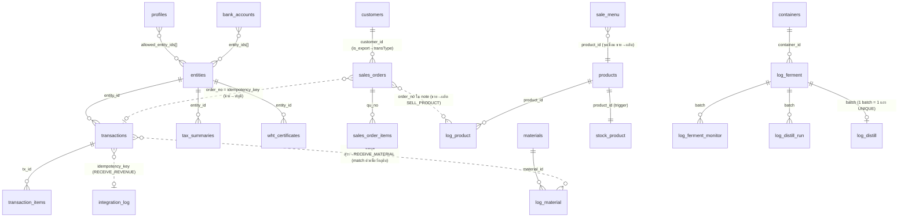

# Insep ERP — แผนย้ายระบบไป Next.js + Vercel + Supabase (v1.0)

> **สถานะ**: เอกสารวางแผน (ยังไม่เริ่ม implement)
> **จัดทำ**: 2026-07-09 โดยแชทวางแผน (Cowork) — อ้างอิงจาก blueprint v1.46 + โค้ดจริงทั้ง 3 แอปใน `clasp-deploy/`
> **วิธีใช้**: เอกสารนี้ + `CLAUDE.md` + `01_CHECKLIST_เตรียมเครื่อง.md` = ชุด handoff สำหรับเปิดแชท Claude Code ใหม่ ทำทีละ Phase (ดู section 12)
> **กติกาสูงสุด**: business logic ทุกจุดที่มีผลต่อตัวเลขบัญชี/ภาษี/สรรพสามิต ต้อง port ให้ output ตรงกับระบบเดิม 100% ก่อน cutover — ห้าม "ปรับปรุงสูตร" ระหว่างย้าย

---

## 0. สรุปการตัดสินใจ (Decision Summary)

| หัวข้อ | ตัดสินใจ | เหตุผลย่อ |
|---|---|---|
| โครงสร้าง Next.js | **1 monorepo, 1 Next.js app, 1 Vercel project** — แยก 3 แอปด้วย route group `/production` `/accounting` `/sales` | DB เดียวกันทำให้ webhook หายไปทั้งหมด, login เดียว, deploy เดียว, debug ที่เดียว |
| Supabase | **1 project, schema `public` เดียว** ชื่อตารางไม่ชนกันอยู่แล้ว | RLS/PostgREST ตั้งที่เดียว, FK ข้ามโดเมนตรง ๆ, supabase-js ใช้ default ได้ |
| Router | **App Router + Server Actions** (ไม่ใช้ Pages Router, API Routes เฉพาะ legacy webhook bridge) | ไฟล์ per-โดเมนชัดเจน เหมาะ workflow "AI เขียนไฟล์เต็ม → ยกทับ" |
| Auth | **Supabase Auth (email+password)** + ตาราง `profiles` (role, allowed_entity_ids) + **RLS จริงฝั่ง DB** | ปิดช่องโหว่ entity-lock UI-level ที่ blueprint ระบุไว้ |
| การคุยข้ามแอป | **หายไปทั้งหมด** — DB เดียว เรียก Postgres function/transaction ตรง ๆ, idempotency ด้วย unique constraint | ไม่มี network ระหว่างแอปแล้ว คิว `acc_sync_queue` + trigger 1 นาที ไม่จำเป็นอีก |
| PDF ราชการ | **คง client-side pdf-lib เหมือนเดิม** — template/font ย้ายไป Supabase Storage | โค้ด fill port ได้เกือบ 1:1, ไม่เจอ limit ของ serverless, ฟอร์มห้ามเพี้ยน |
| ลำดับย้าย | schema/auth → แอปผลิต → แอปบัญชี → แอปขาย → data migration → verify+cutover | ผลิต self-contained สุด, ขายผูกกับอีก 2 แอปจึงทำท้าย |
| Cutover | **ตัดที่ขอบเดือน + shadow verification** (ไม่ double-entry) | คนเดียวคีย์ 2 ระบบพร้อมกันไม่ไหว — ใช้วิธี migrate แล้วเทียบรายงานแทน |

---

## 1. สถาปัตยกรรมภาพรวม

### 1.1 ทำไม 1 monorepo / 1 Vercel project (ไม่แยก 3 project)

เหตุผลหลักที่ **ไม่แยก**:

1. **Webhook เดิมหายไปทั้งหมด** — เหตุผลเดียวที่ 3 แอป GAS ต้องยิง `UrlFetchApp` หากันคือ "คนละ Google Sheet คนละ process" พอทุกแอปใช้ Postgres ก้อนเดียว การ "ขายแล้วตัดสต็อกผลิต + ลงบัญชี" กลายเป็น **database transaction เดียว** ที่ atomic จริง ๆ ซึ่งดีกว่าระบบเดิมที่ต้องพึ่งคิว+retry ถ้าแยก 3 Vercel project จะต้องสร้าง HTTP API ระหว่างกันขึ้นมาใหม่ = ขนปัญหาเก่ากลับมาเอง
2. **Auth เดียว** — ปัจจุบันมี 3 ระบบ login (บัญชี: ชีท `Users` + SHA-256, ขาย: ชีท `inteam` **เก็บรหัสผ่าน plaintext และส่งทั้ง list ให้ browser**, ผลิต: **ไม่มี login เลย** ใครมี URL ก็เข้าได้) — รวมเป็น Supabase Auth ชุดเดียว ปิดช่องโหว่ทั้งสองข้อไปพร้อมกัน
3. **Shared code** — `formatTaxId`, `formatBranch`, `ThaiBaht`, ตาราง `contacts`/`customers`, engine PDF, UI component ใช้ร่วมกันได้โดยไม่ต้อง copy 3 ชุด (ปัจจุบัน `formatTaxId` มีซ้ำ 2 แอป = P0 ข้อ 4 ใน blueprint)
4. **Deploy/debug คนเดียว** — 1 `git push` = ทั้งระบบอัปเดต, log อยู่ dashboard เดียว, ไม่ต้องไล่ว่า error อยู่ project ไหน
5. ข้อเสียของ monorepo (deploy อิสระต่อแอปไม่ได้) ไม่มีผลกับผู้ใช้คนเดียว traffic ต่ำ

การแยกหน้าใช้ **route group ธรรมดา** (ไม่ต้องใช้ subdomain/multi-zone):

```
app/
├── (auth)/login/page.tsx
├── production/          ← แอปผลิต (แท็บเดิม: material, ferment, fermentMonitor,
│   ├── page.tsx            distill, dilute, product, history, admin, report)
│   ├── actions.ts       ← Server Actions ของโดเมนผลิต
│   └── ...
├── accounting/          ← แอปบัญชี (entry, dashboard, accounts, apar, bills,
│   ├── page.tsx            history, pricecheck, reports/50ทวิ)
│   ├── actions.ts
│   └── ...
├── sales/               ← แอปขาย (create, orders, warehouse)
│   ├── page.tsx
│   ├── actions.ts
│   └── ...
├── api/legacy/          ← (เฉพาะช่วง transition — ดู section 8.4) รับ webhook
│   ├── liquor/route.ts     contract เดิมจาก GAS ถ้าจำเป็นต้อง cutover ทีละแอป
│   └── accounting/route.ts
lib/
├── supabase/            ← client helpers (browser + server)
├── shared/              ← formatTaxId, formatBranch, ThaiBaht, ฯลฯ (จุดเดียว)
├── abv/                 ← ABV_CORR_TABLE + correctAbvTo20C (+ test vectors)
└── pdf/                 ← fill engines 3 แบบ (ดู section 5)
```

### 1.2 Supabase: 1 project, schema `public` เดียว

- **ไม่แยก Postgres schema ต่อแอป** เพราะ (ก) PostgREST/supabase-js ต้องตั้ง exposed schemas เพิ่ม เพิ่มจุดพลาดโดยไม่ได้อะไร (ข) ชื่อตารางของ 3 แอปไม่ชนกันอยู่แล้วหลัง rename (ค) FK ข้ามโดเมน (เช่น `sales_order_items.product_id → products`) เขียนตรง ๆ ได้
- จัดกลุ่มด้วย **ชื่อตาราง** แทน: โดเมนผลิต = `log_*`, `materials`, `products`, `containers`, `stock_product` · โดเมนบัญชี = `transactions`, `transaction_items`, `wht_certificates`, `tax_summaries` · โดเมนขาย = `sales_orders`, `sales_order_items`, `customers`, `sale_menu`, `warehouse_stock`, `stock_moves` · ส่วนกลาง = `entities`, `bank_accounts`, `profiles`, `contacts`, `app_settings`, `integration_log`, `scan_log`
- ตาราง `API_Log` เดิม (มีทั้ง 2 แอป) ยุบเป็น `integration_log` ตัวเดียว + **unique constraint แทนการ scan หา key ซ้ำ** (section 2.6)

### 1.3 App Router + Server Actions (เหตุผลเทียบทางเลือก)

| ทางเลือก | เหมาะไหมกับ workflow "AI เขียนไฟล์เต็ม → copy-paste" |
|---|---|
| Pages Router + API Routes | ❌ 1 feature กระจาย 2-3 ไฟล์ (page + api + fetch code) และเป็นแนวทางเก่าที่เอกสาร/AI รุ่นใหม่เลิกเน้น |
| App Router + Server Components ล้วน | ⚠️ ดีสำหรับหน้า read-only แต่ฟอร์มหนัก ๆ แบบแอปนี้ (คำนวณสด, SweetAlert, Chart.js) ยังต้อง client component เยอะ |
| **App Router + Client Components + Server Actions** ✅ | 1 โดเมน = `page.tsx` (UI) + `actions.ts` (ทุกฟังก์ชันที่เดิมเป็น `google.script.run.xxx`) — โครงแทบจะ map 1:1 กับไฟล์ `_js_*.html` + `.gs` เดิม แก้ทีละไฟล์ยกทับได้ |

กติกาเสริมสำหรับ AI-workflow: **ห้าม logic สำคัญฝังใน component** — การคำนวณเงิน/ดีกรี/สต็อกทุกตัวอยู่ใน `lib/` หรือ `actions.ts` หรือ Postgres function เพื่อให้เขียน unit test เทียบ output ได้

- หน้า UI ทำเป็น client component เป็นหลัก (แอปเดิมเป็น SPA แบบ tab อยู่แล้ว) — เรียก Server Actions แทน `google.script.run` (รูปแบบ callback `withSuccessHandler` → `await` + `try/catch`)
- ใช้ **TypeScript** ทั้ง repo (AI เขียนแม่นขึ้น type ช่วยจับ column เลื่อน — ปัญหาประจำของระบบ sheet index)
- UI library: **Tailwind CSS** (แอปเดิมใช้ Tailwind CDN อยู่แล้ว — class เดิม copy มาได้เยอะ) + sweetalert2 + chart.js เหมือนเดิม (ลด friction ตอน port)

---

## 2. Database Schema (Postgres/Supabase)

> หลักการแปลง: sheet 1 ใบ = ตาราง 1 ตัว, คอลัมน์ index → ชื่อ column จริง, ค่า enum ภาษาไทย ("รับ"/"จ่าย"/"รายรับ"...) **เก็บเป็นภาษาไทยเหมือนเดิม** (CHECK constraint กันสะกดผิด) เพื่อให้ migration ตรงไปตรงมาและรายงานราชการใช้คำเดิม
> จำนวนเงินใช้ `numeric(14,2)` · ปริมาณ/ดีกรีใช้ `numeric` ไม่จำกัดทศนิยม (ดีกรี@20 มีทศนิยม 2 ตำแหน่ง, ปริมาณลิตรมีทศนิยมหลายตำแหน่ง)

### 2.1 ตารางส่วนกลาง (core)

```sql
-- กิจการ (จากชีท Entities แอปบัญชี)
create table entities (
  entity_id text primary key,          -- 'EID01'
  name text not null,
  type text,
  is_vat boolean not null default false,
  tax_id text,
  branch text default 'สำนักงานใหญ่',
  address text,
  excise_id text                       -- เลขทะเบียนสรรพสามิต (เดิม EXCISE_ID ใน Properties แอปผลิต
                                       -- — มีเฉพาะ entity ที่เป็นโรงสุรา)
);

-- บัญชีเงิน (จากชีท Accounts) — entity_ids array = บัญชีใช้ร่วมข้ามกิจการ (ตามเดิม)
create table bank_accounts (
  account_id text primary key,
  account_name text not null unique,   -- Transactions อ้างด้วย "ชื่อบัญชี" (Option A เดิม)
  entity_ids text[] not null default '{}',
  kind text,
  opening_balance numeric(14,2) not null default 0,
  opening_date date
);

-- ผู้ใช้ (รวม Users ของบัญชี + inteam ของขาย เป็นชุดเดียว, ผูก Supabase Auth)
create table profiles (
  id uuid primary key references auth.users(id) on delete cascade,
  username text not null unique,
  display_name text,
  role text not null default 'viewer'
    check (role in ('main','viewer','sale','warehouse')),
  allowed_entity_ids text[],           -- null = ALL (ตามความหมาย 'ALL' เดิม)
  created_at timestamptz not null default now()
);

-- คู่ค้า (ชีท Contacts แอปบัญชี)
create table contacts (
  contact_id text primary key,         -- 'C-0001' (running เดิม)
  name text not null,
  tax_id text,
  branch text,
  address text,
  contact_type text,                   -- 'ผู้ขาย'/'ลูกค้า'
  created_at timestamptz not null default now()
);
create unique index contacts_name_norm on contacts (lower(trim(name)));
-- ↑ แทน logic B.2.2 เดิม (กัน contact ซ้ำจาก whitespace/case)

-- ค่าตั้งค่า (ชีท Settings คอลัมน์ A-E → แถวแบบ kind/value)
create table app_settings (
  id bigserial primary key,
  kind text not null check (kind in
    ('expense_cat','income_cat','wht_rate','tax_account')),
  value text not null,
  sort int not null default 0,
  unique (kind, value)
);
-- หมายเหตุ: Settings col A (accounts) เดิม → ใช้ bank_accounts แทน
-- tax_account = รายชื่อบัญชีในระบบภาษี (แทน getTaxAccountSet_ + fallback 'บัญชีบริษัท')

-- log กลางของ integration ทุกจุด (ยุบ API_Log 2 แอป + ทำหน้าที่แทน acc_sync_queue)
create table integration_log (
  id bigserial primary key,
  action text not null,                -- 'SELL_PRODUCT' / 'RECEIVE_MATERIAL' / 'RECEIVE_REVENUE'
  idempotency_key text,
  status text not null,                -- 'ok' / 'duplicate' / 'failed'
  message text,
  payload jsonb,                       -- snapshot payload (แทน payloadJson ของคิวเดิม)
  created_at timestamptz not null default now()
);
-- 🔑 หัวใจ idempotency ใหม่: unique แทนการ scan sheet ทั้งใบ
create unique index integration_ok_key
  on integration_log (action, idempotency_key)
  where status = 'ok' and idempotency_key is not null;
```

### 2.2 โดเมนบัญชี

```sql
-- Transactions 27 คอลัมน์ → ตารางเดียว ชื่อ column ตรง buildTxRow_ เดิม
create table transactions (
  tx_id text primary key,                       -- col 0  'TR-yyyyMMdd-NNNN'
  created_at timestamptz not null default now(),-- col 1  timestamp
  transaction_date date not null,               -- col 2
  type text not null check (type in ('รายรับ','รายจ่าย','โอนระหว่างบัญชี','เช็คราคา')),
  account_name text,                            -- col 4  [Option A] ชื่อบัญชีจริงเสมอ
                                                --        (ว่าง = บิลตั้งค้าง/เช็คราคา — ห้าม NOT NULL)
  category text,                                -- col 5
  contact_name text,                            -- col 6
  description text,                             -- col 7
  base_amount numeric(14,2) not null default 0, -- col 8
  discount numeric(14,2) not null default 0,    -- col 9
  amount_after_discount numeric(14,2) not null default 0, -- col 10
  vat_amount numeric(14,2) not null default 0,  -- col 11
  wht_rate numeric(5,2) not null default 0,     -- col 12
  wht_amount numeric(14,2) not null default 0,  -- col 13
  net_amount numeric(14,2) not null default 0,  -- col 14
  tax_invoice_no text,                          -- col 15
  tax_invoice_date date,                        -- col 16
  receipt_image_url text,                       -- col 17 (→ Supabase Storage URL)
  status text not null default 'ปกติ',          -- col 18 ('ปกติ'/'ยกเลิก')
  transfer_id text,                             -- col 19 'TRF-yyyyMMdd-NNNN'
  entity_id text not null references entities(entity_id), -- col 20
  ap_ar_status text check (ap_ar_status in ('AP','AR')),  -- col 21 (null = ปกติ/settled)
  payment_date date,                            -- col 22
  po_group_id text,                             -- col 23
  installment_no int,                           -- col 24
  installment_total int,                        -- col 25
  due_date date,                                -- col 26
  -- คอลัมน์ใหม่ (ไม่มีใน sheet):
  idempotency_key text,                         -- จาก webhook/แอปขาย (แทน API_Log scan)
  source text not null default 'ui'             -- 'ui' / 'sales' / 'migration'
);
create unique index tx_idem on transactions (idempotency_key)
  where idempotency_key is not null;
create index tx_entity_date on transactions (entity_id, transaction_date);
create index tx_contact on transactions (contact_name);
create index tx_pogroup on transactions (po_group_id) where po_group_id is not null;
create index tx_apar on transactions (ap_ar_status) where ap_ar_status is not null;

create table transaction_items (                -- Transaction_Items 11 คอลัมน์
  item_id text primary key,                     -- '{txId}-NN'
  tx_id text not null references transactions(tx_id),
  item_name text not null,
  quantity numeric not null default 1,
  in_vat numeric(14,2) not null default 0,
  ex_vat numeric(14,2) not null default 0,
  total_price numeric(14,2) not null default 0, -- หลังหักส่วนลด item ก่อน VAT (Phase A เดิม)
  discount_pct numeric(7,3) not null default 0,
  discount_baht numeric(14,2) not null default 0,
  item_category text,
  item_job text
);
create index ti_tx on transaction_items (tx_id);

-- Tax_Summaries (append ทุกครั้งที่ generate ภพ.30 — getPreviousVAT อ่านแถวล่าสุดของเดือนก่อน)
create table tax_summaries (
  id bigserial primary key,
  report_month text not null,                   -- 'yyyy-MM' (เดิมกัน auto-convert ด้วย apostrophe)
  total_sales_amount numeric(14,2), total_sales_vat numeric(14,2),
  total_purchase_amount numeric(14,2), total_purchase_vat numeric(14,2),
  forwarded_vat_in numeric(14,2), net_payable numeric(14,2),
  forwarded_vat_out numeric(14,2),
  entity_id text references entities(entity_id),
  created_at timestamptz not null default now()
);
create index ts_month_entity on tax_summaries (report_month, entity_id, created_at desc);

-- pnd3-53 → ทะเบียน 50ทวิ (10 คอลัมน์เดิม)
create table wht_certificates (
  doc_no text primary key,                      -- '69-001' (running ต่อปี พ.ศ.)
  issue_date date not null,
  contact_name text,
  address text,                                 -- ตรวจ col เดิมตอน implement (col 3)
  wht_amount numeric(14,2),
  pnd_type text,                                -- 'ภงด.3'/'ภงด.53'
  income_type text, base_amount numeric(14,2),  -- ตรวจ col เดิม
  tx_ids text[] not null default '{}',          -- col 8 เดิม comma-separated → array
  entity_id text not null default 'EID01' references entities(entity_id)
);

create table scan_log (                          -- Scan_Log 5 คอลัมน์ + rate limit
  id bigserial primary key,
  created_at timestamptz not null default now(),
  user_email text, status text, confidence text, error_message text
);
```

**ประเด็นออกแบบที่จงใจคงไว้ตามเดิม (อย่า normalize ตอนย้าย):**

- `transactions.account_name` และ `contact_name` เก็บเป็น **string** ไม่แปลงเป็น FK — ระบบเดิมผูกด้วยชื่อ (Option A + contactMap by name) การแปลงเป็น id กลางคันเสี่ยงข้อมูลเก่า match ไม่ครบ → ค่อยทำหลังระบบนิ่ง
- `wht_certificates.tx_ids` เป็น array (เดิม comma-separated ใน col 8 รองรับ merge หลาย tx ต่อ 1 ใบ)
- แถว "โอนระหว่างบัญชี" ยังเป็น **2 แถว (ออก/เข้า) ผูกด้วย transfer_id** เหมือนเดิม — logic balance/statement เดิมคิดแบบนี้

### 2.3 โดเมนขาย

> ลำดับไฟล์ migration จริง: สร้างโดเมนผลิต (2.4) ก่อนโดเมนขาย — `sale_menu.product_id` FK ไปที่ `products`

```sql
create table customers (                         -- custdata 10 คอลัมน์
  customer_id text primary key,                  -- 'C001' (ระวังชนกับ contacts 'C-0001' — คนละตาราง)
  name text not null,
  address text,
  tax_id text,
  phone text, email text,
  credit_term int not null default 0,
  sale_name text,
  branch text,
  is_export boolean not null default false       -- col J → ตัดสิน transType ไปแอปผลิต
);

create table sale_menu (                         -- menu_b2b 5 คอลัมน์
  id bigserial primary key,
  menu_name text not null unique,
  price numeric(14,2) not null default 0,
  category text,                                 -- 'สุรา' → trigger ตัดสต็อกผลิต
  product_id text references products(product_id), -- FK ไปโดเมนผลิต (จุดเชื่อมขาย↔ผลิต)
  multiplier numeric not null default 1
);

create table sales_orders (                      -- btbtransaction 31 คอลัมน์
  qu_no text primary key,                        -- col 4 'QUyyMMdd-NNN'
  created_at timestamptz not null default now(), -- col 0
  customer_id text references customers(customer_id), -- col 1
  customer_name text,                            -- col 2 (snapshot ตอนสร้าง — คงไว้)
  sale_name text,                                -- col 3
  qu_expire date,                                -- col 5
  sub_total numeric(14,2) default 0, discount numeric(14,2) default 0,
  sub_discount numeric(14,2) default 0, vat_amount numeric(14,2) default 0,
  grand_total numeric(14,2) default 0,           -- col 6-10
  order_no text unique,                          -- col 11 'ORDyyMMdd-NNN'
  status text not null default 'รอคอนเฟิร์ม',    -- col 12
  deposit numeric(14,2) default 0,               -- col 13
  outstanding_balance numeric(14,2) default 0,   -- col 14
  due_date date, payment_method text,            -- col 15-16
  inv_no text, tax_no1 text, tax_no2 text,       -- col 17-19
  remarks text,                                  -- col 20
  doc_date1 date, doc_date2 date,                -- col 21-22
  check_detail1 text, check_detail2 text,        -- col 23-24
  wht_percent numeric(5,2) default 0, wht_amount numeric(14,2) default 0,
  net_payable numeric(14,2) default 0,           -- col 25-27
  doc_to_print text, next_status text,           -- col 28-29
  category text default 'รายได้ค่าสินค้า'        -- col 30
);
create index so_status on sales_orders (status);

create table sales_order_items (                 -- btbsales 8 คอลัมน์
  id bigserial primary key,
  created_at timestamptz not null default now(),
  qu_no text not null references sales_orders(qu_no),
  item_name text not null,                       -- col 4
  qty numeric not null default 0,                -- col 5
  price numeric(14,2) not null default 0,        -- col 6
  extra1 text, extra2 text                       -- ⚠️ col 0-2,7 ของ btbsales ต้องเปิดชีทจริง
                                                 --    ยืนยัน header ก่อนเขียน migration (ดู sec 11)
);
create index soi_qu on sales_order_items (qu_no);

create table warehouse_stock (                   -- curstock (สินค้า non-สุรา, manual adj. only)
  item_code text primary key,                    -- col 0
  item_name text,                                -- col 1
  col2 text,                                     -- ⚠️ ยืนยัน header จริง (โค้ดใช้แค่ 0,1,3,4)
  unit text,                                     -- col 3
  qty numeric not null default 0                 -- col 4
);

create table stock_moves (                       -- stockmove 10 คอลัมน์
  id bigserial primary key,
  created_at timestamptz not null default now(),
  item_code text, item_name text,
  qty_before numeric, action text,               -- 'IN'/'OUT'
  qty numeric, ref_no text, qty_after numeric,
  user_name text, remarks text
);
-- inteam → ยุบเข้า profiles (role 'sale'/'warehouse') — เลิกเก็บรหัสผ่าน plaintext
-- acc_sync_queue → ❌ ไม่สร้าง (ดู section 4.2)
```

### 2.4 โดเมนผลิต

```sql
create table materials (                         -- Master_Material
  material_id text primary key,                  -- 'รหัสวัตถุดิบ'
  name text not null unique,                     -- 'ชื่อวัตถุดิบ' — RECEIVE_MATERIAL match ด้วยชื่อเป๊ะ
  unit text                                      -- 'หน่วยนับ'
);

create table containers (                        -- Master_Container
  container_id text primary key,                 -- 'รหัสภาชนะ'
  container_type text,                           -- 'ประเภทภาชนะ'
  capacity_l numeric                             -- 'ความจุ(ลิตร)'
);

create table products (                          -- Master_Product
  product_id text primary key,                   -- 'รหัสสินค้า'
  name text not null,                            -- 'ชื่อสุรา' (หลาย product_id ชื่อเดียวกันได้ —
                                                 --  รายงานผลิต aggregate ตามชื่อ)
  degree numeric,                                -- 'ดีกรี'
  bottle_size_l numeric,                         -- 'ขนาดขวด(ลิตร)'
  liquor_type text,                              -- 'ประเภทสุรา' (หัวฟอร์ม ภส.)
  liquor_kind text                               -- 'ชนิดสุรา'
);

create table log_material (                      -- Log_Material 7 คอลัมน์
  id bigserial primary key,
  created_at timestamptz not null default now(),
  doc_date date not null,
  trans_type text not null check (trans_type in
    ('รับ','จ่าย','ผลิตสินค้าอื่น','เสียหาย','อื่นๆ','อื่น ๆ')),
  material_id text not null references materials(material_id),
  amount numeric not null,
  doc_ref text,                                  -- 'หลักฐานเลขที่' (เบิกหมัก = batch)
  note text
);
create index lm_mat_date on log_material (material_id, doc_date);

create table log_ferment (                       -- Log_Ferment 8 คอลัมน์
  id bigserial primary key,
  created_at timestamptz not null default now(),
  ferment_date date not null,                    -- 'วันที่ลงหมัก'
  product_name text not null,                    -- 'ชื่อสุรา'
  batch text not null,                           -- 'รหัสBatch' n/yy — ★หลาย row/batch ได้ (หลายถัง)
  container_id text references containers(container_id),
  container_qty numeric,                         -- 'จำนวนภาชนะ(หน่วย)'
  material_ids text,                             -- comma string ตามเดิม (คงไว้เพื่อ fidelity)
  material_amounts text                          -- ★ค่าแรก = วัตถุดิบหลัก = ฐานคิดส่า (fermVol)
);
create index lf_batch on log_ferment (batch);
-- ⚠️ จงใจไม่ normalize เป็น child table ในเฟสแรก: logic ส่า/fermVol ใช้ "ค่าแรกของ comma list"
--    (parseFloat(split(',')[0])) — port ให้ตรงก่อน แล้วค่อย normalize เฟสหลังถ้าต้องการ

create table log_distill (                       -- Log_Distill 6 คอลัมน์
  id bigserial primary key,
  created_at timestamptz not null default now(),
  distill_date date not null,
  product_name text not null,
  batch text not null unique,                    -- ★★ กฎเหล็ก 1 batch = 1 แถว → DB บังคับให้เลย
  vol numeric not null,                          -- 'ปริมาณน้ำสุราที่ได้(ลิตร)'
  abv numeric not null                           -- 'ดีกรี' @20°C (ปรับเทียบแล้ว)
);

create table log_distill_run (                   -- Log_DistillRun 17 คอลัมน์
  id bigserial primary key,
  created_at timestamptz not null default now(), -- ★source of truth ของ t=0/นาทีที่ (resume timer)
  run_id text not null,                          -- 'DR-yyyyMMdd-HHmmss'
  pot_no int not null,
  batch text not null,
  product_name text,
  minute numeric,                                -- elapsed จาก marker
  phase text check (phase in ('เริ่มกลั่น','หัว','กลาง','หาง','จบหม้อ')),
  abv_obs numeric, temp_spirit numeric, abv20 numeric,
  cum_vol numeric,                               -- ★สะสมต่อช่วง (reset เมื่อเปลี่ยนช่วง)
  flow_rate numeric, vapor_temp numeric, pot_temp numeric, cool_temp numeric,
  note text,
  ferm_charge numeric                            -- เฉพาะแถว marker 'เริ่มกลั่น'
);
create index ldr_batch on log_distill_run (batch, pot_no);

create table log_ferment_monitor (               -- Log_FermentMonitor 9 คอลัมน์
  id bigserial primary key,
  created_at timestamptz not null default now(),
  measure_date date not null, measure_time text,
  batch text not null, product_name text,
  ph numeric, brix numeric, temp numeric, note text
);
create index lfm_batch on log_ferment_monitor (batch);

create table log_dilute (                        -- Log_Dilute 10 คอลัมน์
  id bigserial primary key,
  created_at timestamptz not null default now(),
  dilute_date date not null,                     -- 'วันที่ปรุงแต่ง'
  product_name text not null,
  bottle_size text,
  start_vol numeric, start_abv numeric, water numeric,
  final_vol numeric, final_abv numeric, note text
);

create table log_product (                       -- Log_Product 6 คอลัมน์
  id bigserial primary key,
  created_at timestamptz not null default now(),
  doc_date date not null,
  trans_type text not null check (trans_type in
    ('รับ','จ่าย','จำหน่ายต่างประเทศ','แตกหักเสียหาย','เสียหาย','อื่นๆ','อื่น ๆ')),
  product_id text not null references products(product_id),
  amount numeric not null,                       -- จำนวน(ขวด)
  note text                                      -- ลูกค้า/หมายเหตุ (มี ORDxxxxxx-NNN ถ้าจากแอปขาย)
);
create index lp_prod_date on log_product (product_id, doc_date);

create table stock_product (                     -- Stock_Product (materialized running balance)
  product_id text primary key references products(product_id),
  balance numeric not null default 0,
  last_updated timestamptz not null default now()
);
```

**Stock running balance** — แทน `updateStockBalance_` + LockService ด้วย **Postgres trigger** (atomic ในตัว ไม่ต้อง lock เอง):

```sql
create or replace function trg_update_stock_product() returns trigger as $$
begin
  insert into stock_product (product_id, balance, last_updated)
  values (new.product_id,
          case when new.trans_type = 'รับ' then new.amount else -new.amount end,
          now())
  on conflict (product_id) do update
    set balance = stock_product.balance +
          case when new.trans_type = 'รับ' then new.amount else -new.amount end,
        last_updated = now();
  return new;
end $$ language plpgsql;
create trigger log_product_stock after insert on log_product
  for each row execute function trg_update_stock_product();
-- + ฟังก์ชัน recompute_stock_product() ไว้ซ่อม/seed (แทน runRecomputeStock)
--   และ pg_cron รายสัปดาห์แทน weeklyRecomputeStock (safety net เดิม อา. 03:00)
-- ⚠️ ทิศทาง +/- ต้องตรง isStockInbound_ เดิมเป๊ะ: บวกเฉพาะ 'รับ' ที่เหลือลบทั้งหมด
-- ⚠️ ระวัง: การแก้/ลบแถว log_product ตรง ๆ ใน DB จะไม่ปรับ balance (เดิมก็เป็น) —
--    ถ้าอยากกันเพิ่ม ใส่ trigger update/delete หรือห้ามแก้ผ่าน RLS แล้วใช้ recompute
```

### 2.5 ER Diagram (ความสัมพันธ์ข้ามโดเมน)



(เส้นประ = ความสัมพันธ์เชิง logic ผ่าน key/ข้อความ ไม่ใช่ FK — คงพฤติกรรมเดิม)

### 2.6 อะไร normalize / อะไรเก็บ JSONB / unique constraint แทน idempotency เดิม

| เดิม | ใหม่ | เหตุผล |
|---|---|---|
| `Entities`, `Accounts`, `Users`, `Contacts`, `Master_*`, `custdata`, `menu_b2b` | **ตาราง normalized จริง** (FK) | เป็น master data อ้างอิงบ่อย |
| `acc_sync_queue.payloadJson` | `integration_log.payload jsonb` (audit เท่านั้น) | ไม่มีคิวแล้ว เก็บ snapshot ไว้ตรวจย้อนหลัง |
| `Log_Ferment` matIds/matAmounts (comma) | **คง text ตามเดิม** เฟสแรก | logic ส่า `split(',')[0]` ต้อง byte-compatible |
| `pnd3-53` col 8 (txId คั่น comma) | `text[]` | Postgres รองรับ array ตรง ๆ query ง่ายขึ้น ไม่กระทบ logic |
| idempotency: scan `API_Log` ทั้งชีท (2 แอป) | **partial unique index** บน `integration_log(action, idempotency_key)` + `transactions(idempotency_key)` | O(1), atomic, กัน race โดยไม่ต้อง LockService — insert ชน unique = duplicate → คืน tx เดิม |
| running number scan sheet + PropertiesService counters | ตาราง `counters(key text pk, value bigint)` + ฟังก์ชัน `next_serial(key)` (`update ... returning`) | atomic ใน DB เดียว, รูปแบบเลขเดิมทุกตัว: `TR-yyyyMMdd-NNNN`, `TRF-`, `QUyyMMdd-NNN`, `ORD`, `INV`, `TAX`, `C-NNNN`, `C{NNN}` (ลูกค้าขาย), WHT `{ปีพ.ศ.2หลัก}-NNN` |

---

## 3. Auth & สิทธิ์การเข้าถึง (RLS)

### 3.1 Supabase Auth + profiles

- ใช้ **Supabase Auth email+password** — user เดิมมีน้อย (เจ้าของ + ผู้ใช้ดูอย่างเดียว + ทีมขาย/คลัง) สร้างมือใน dashboard ได้ ไม่ต้องทำหน้า register
- username เดิม → email รูปแบบ `username@insep.local` หรืออีเมลจริง (ตัดสินตอน setup) — `profiles.username` เก็บชื่อแสดงผลเดิม
- **รหัสผ่านเดิม migrate ไม่ได้** (บัญชีเก็บ SHA-256 ฝั่งเรา, Supabase ใช้ bcrypt ของตัวเอง; ขายเก็บ plaintext) → ตั้งรหัสใหม่ตอน cutover (มีผู้ใช้ไม่กี่คน)
- mapping role: บัญชี `main` → `main` (ทำได้ทุกอย่าง), บัญชี `AIM`/อื่น ๆ → `viewer` (อ่านอย่างเดียว + จำกัด entity), ขาย `sale`/`warehouse` → role ตามชื่อ, **แอปผลิต: เดิมไม่มี login เลย → หลังย้ายต้อง login (role main)** ← อัปเกรดความปลอดภัยที่ได้ฟรี

### 3.2 RLS จริงฝั่ง database (ปิดช่องโหว่เดิม)

Blueprint ระบุชัดว่า entity-lock เดิม enforce แค่ UI — ตอนย้ายคือโอกาสแก้ หลักการ:

```sql
-- helper functions (security definer, อ่าน profiles ของ auth.uid())
create function my_role() returns text ...;
create function my_entities() returns text[] ...;  -- null = ALL

alter table transactions enable row level security;

-- อ่าน: จำกัดตาม allowed_entity_ids (null = เห็นหมด)
create policy tx_select on transactions for select using (
  my_entities() is null or entity_id = any (my_entities())
);
-- เขียน/แก้/void: เฉพาะ main (ตรงพฤติกรรม applyRolePermissions เดิม
-- ที่ซ่อนหน้าบันทึก/ปุ่มโอน/settle/edit จาก non-main)
create policy tx_write on transactions for insert with check (
  my_role() = 'main'
  and (my_entities() is null or entity_id = any (my_entities()))
);
-- update/delete ทำนองเดียวกัน (void = update status → policy update ครอบ)
```

- ทำแบบเดียวกันกับทุกตารางบัญชี (`transaction_items`, `wht_certificates`, `tax_summaries` filter ผ่าน entity)
- ตารางผลิต/ขาย: role `main` เขียนได้ทั้งหมด; `sale` เขียน `sales_orders`/`sales_order_items`/`customers`; `warehouse` เขียน `stock_moves`/`warehouse_stock` + ยืนยันจัดส่ง; `viewer` อ่านอย่างเดียว — **ตาราง log ผลิตให้เขียนเฉพาะผ่าน RPC (security definer)** เพื่อบังคับผ่าน business logic (กันเขียน log ตรงโดยไม่อัปเดต stock)
- Service role key ใช้เฉพาะ (ก) migration script (ข) legacy webhook bridge — **ห้ามอยู่ใน client bundle**

### 3.3 Booking system (คำถามที่ต้องตอบก่อนเริ่ม — ไม่ตัดสินใจแทน)

ผู้ใช้กำลังสำรวจระบบจองบาร์/เวิร์กช็อป (ลูกค้าภายนอก self-booking) แยกอยู่ คำถามที่ต้องตอบก่อนออกแบบ auth ตายตัว:

1. ระบบจองจะให้ **ลูกค้าทั่วไป** login (หรือจองแบบ guest) ใช่ไหม? ถ้าใช่ — เป็นคนละ "ชนชั้นผู้ใช้" กับพนักงาน ERP โดยสิ้นเชิง
2. อยากให้ข้อมูลการจองไหลเข้าบัญชี/สต็อกอัตโนมัติไหม (เช่น มัดจำ → `transactions`)?
3. Domain/แบรนด์ที่ลูกค้าเห็น ต้องแยกจากระบบภายในไหม?

ข้อสังเกตประกอบการตัดสินใจ (ยังไม่ฟันธง): ถ้าคำตอบข้อ 2 คือ "อยาก" — ใช้ **Supabase project เดียวกัน** จะง่ายสุด (booking เขียน `transactions` ผ่าน RPC ได้เลย) แต่แยก **Next.js app / Vercel project ต่างหาก** สำหรับหน้า public เพื่อไม่ให้โค้ดลูกค้าภายนอกปนกับ ERP ภายใน และ RLS ต้องเพิ่ม role `customer` ที่เห็นเฉพาะการจองของตัวเอง — ทั้งหมดนี้ **ไม่ต้องทำในการ migrate รอบนี้** แค่ออกแบบ schema/RLS ไม่ให้ปิดทางไว้ (ซึ่งแนวทางข้างบนไม่ปิดทาง)

---

## 4. Data Flow ระหว่าง 3 โดเมน (แทน webhook เดิม)

### 4.1 หลักการ: webhook → database transaction

ทางเลือกที่พิจารณา: (ก) Server Actions เรียกตรง (monorepo เดียว) (ข) Supabase Database Webhooks (ค) Supabase Realtime (ง) Postgres function/trigger
**เลือก (ก)+(ง) ผสม**: Server Action เป็น entry point → เรียก **Postgres function (RPC)** สำหรับงานที่ต้อง atomic ข้ามหลายตาราง เหตุผล: (ข)/(ค) เป็น async ผ่าน network = ต้องทำ retry/monitoring เหมือนเดิม ทั้งที่ปัญหา "คนละ process" หมดไปแล้ว — อย่าสร้าง distributed system โดยไม่จำเป็น

### 4.2 Mapping contract เดิม → ใหม่ (ทุกจุดคง idempotency)

**(2.2 เดิม) ขาย → ผลิต `SELL_PRODUCT`** — จุดเรียก: ยืนยันจัดส่ง (`confirmFulfillmentAndDeductStock`) เฉพาะ item ที่ `sale_menu.category='สุรา'`

```sql
-- RPC: fn_sell_product(p_idempotency_key, p_date, p_trans_type, p_note, p_items jsonb)
-- ใน transaction เดียว:
--   1. insert integration_log (action='SELL_PRODUCT', key, 'ok')
--      → ชน unique = เคย process แล้ว → return {duplicate:true} (แทน isIdempotentDuplicate_)
--   2. insert log_product ทีละ item (trigger อัปเดต stock_product อัตโนมัติ)
-- อย่างใดอย่างหนึ่ง fail = rollback ทั้งก้อน (ดีกว่าเดิมที่ log กับ balance แยก lock)
```

| payload เดิม | ใหม่ | เปลี่ยน? |
|---|---|---|
| `token` | ❌ ตัด — auth ผ่าน session + RPC security definer | เปลี่ยน |
| `idempotencyKey` = orderNo | เหมือนเดิม (unique index) | คงเดิม |
| `date`, `transType`, `note`, `items[{productId, amount}]` | parameter RPC ชื่อเดิม | คงเดิม |
| `transType` จาก `custdata.isExport` → "จำหน่ายต่างประเทศ"/"จ่าย" | จาก `customers.is_export` | คงเดิม |
| `amount = qty × multiplier` (menu_b2b col E) | `qty × sale_menu.multiplier` | คงเดิม |

**(2.1 เดิม) ขาย → บัญชี `RECEIVE_REVENUE`** — จุดเรียก: `processB2BOrderAction` (4 action เดิม: DEPOSIT_AND_SEND / FULL_PAYMENT_AND_SEND / FULL_PAYMENT_LATER / PAY_BALANCE)

```
Server Action processOrderAction(quNo, action, payload):
  1. update sales_orders (สถานะ/ยอด/เลขเอกสาร — logic เดิมทุก branch)
  2. คำนวณ accPayload สูตรเดิมเป๊ะ:
     accPreVat = accNet / (1 + 0.07 − whtRate/100)  ถ้ามี WHT, ไม่งั้น accNet / 1.07
     accVat = accPreVat × 0.07 · accWht = accPreVat × (whtRate/100)
     FULL_PAYMENT_* : accBase = sub_total เดิม, accDiscount = discount เดิม
     อื่น ๆ          : accBase = accPreVat, accDiscount = 0
     ปัดทุกตัว Math.round(x*100)/100 เหมือนเดิม
  3. insert transactions ผ่านฟังก์ชันกลางตัวเดียวกับหน้า entry
     (แทน buildTxRow_) พร้อม idempotency_key:
       orderNo            (deposit/full)     ← เดิม
       orderNo + '-balance' (PAY_BALANCE)     ← เดิม
     ชน unique → คืน duplicate:true + tx_id เดิม (พฤติกรรม doPost เดิม)
  4. items แนบเฉพาะ isFirstPayment=true (PAY_BALANCE ส่ง items ว่าง) ← เดิม
  5. LINE notify (ดู 4.4)
```

| ประเด็น | เดิม | ใหม่ |
|---|---|---|
| การส่ง | คิว `acc_sync_queue` + trigger 1 นาที + retry 5 ครั้ง + หน้าคิว | **insert ตรงใน transaction เดียวกัน** — สำเร็จ/ล้มพร้อมออเดอร์ ไม่มีสถานะ "ค้างคิว" อีก |
| หน้าคิว (salesView='queue') | ตาราง pending/failed + countdown + ปุ่มยิง | เปลี่ยนเป็น **หน้า "ประวัติ sync"** อ่าน `integration_log` (โปร่งใสเท่าเดิม แต่ไม่มีอะไรต้องกดยิงแล้ว) |
| แถว fallback `accountType: "กสิกร insep"` (hardcode ใน Orders.gs) | ย้ายเป็นค่า config ในตาราง `app_settings` หรือ env — **ยืนยันชื่อบัญชีจริงกับผู้ใช้ก่อน** | ⚠️ |

**(2.3 เดิม) บัญชี → ผลิต `RECEIVE_MATERIAL`** — จุดเรียก: `saveTransaction` เมื่อ `type='รายจ่าย' && category='ต้นทุนสุรา' && entity_id = LIQUOR_ENTITY_ID`

- เดิม: ยิง HTTP แล้วถ้า fail **บัญชียังบันทึกสำเร็จ + คืน apiWarning** (toast เหลือง) → **คงพฤติกรรมนี้**: บันทึก transactions commit ก่อน แล้วค่อยพยายาม insert `log_material` เป็นขั้นแยก; ถ้า material name ไม่ match `materials.name` เป๊ะ (เงื่อนไขเดิม) → บันทึก `integration_log` status='failed' + คืน apiWarning ข้อความแนวเดิม
- match ด้วย **ชื่อวัตถุดิบตรงเป๊ะ** (trim แล้วเทียบ) เหมือนเดิม — อย่าเปลี่ยนเป็น fuzzy

### 4.3 ตัวแทนคิว background + trigger เดิมทั้งหมด

| Trigger GAS เดิม | ใหม่ |
|---|---|
| `processAccSyncQueue` ทุก 1 นาที (ขาย) | ❌ ไม่ต้องมี (insert ตรง) |
| `weeklyRecomputeStock` อาทิตย์ 03:00 (ผลิต) | **pg_cron** ใน Supabase: `select cron.schedule('weekly-recompute','0 3 * * 0', $$select recompute_stock_product()$$)` (Vercel Cron ก็ได้ แต่ pg_cron อยู่ติด DB ไม่ต้องผ่าน HTTP) |
| cleanup temp PDF ใน Drive (`cleanupOrphanedPDFExports`) | ❌ ไม่จำเป็น — ระบบใหม่ไม่สร้างไฟล์ temp ใน Drive |
| `SCAN_COUNT_<date>_<email>` properties + cleanup | ตาราง `scan_log` + นับ count วันนี้ด้วย query (ไม่ต้อง cleanup) |

### 4.4 LINE Notify

`sendLineNotification` (ขาย: รับชำระ/จัดส่ง + สต็อกคงเหลือ) → ย้ายเป็น util ฝั่ง server (`lib/line.ts`) เรียกจาก Server Action หลัง commit — **silent fail เหมือนเดิม** (ห้าม throw ทับ business logic) ข้อความ format เดิม

---

## 5. PDF Generation (ฟอร์มราชการ/ภาษี) — ห้ามเพี้ยนแม้ 1 mm

### 5.1 ระบบเดิมมี "3 กลไก" ต้อง port แยกกัน (สำคัญ — อย่าเหมารวม)

| กลไก | ฟอร์ม | ไฟล์เดิม | วิธี |
|---|---|---|---|
| **A. Coordinate overlay** (pdf-lib `drawText` ที่ x,y + THSarabun via fontkit) | ภส.๐๗-๐๑/๑, ๐๗-๐๒/๑(๑), ๐๗-๐๒/๑(๒), ๐๗-๐๔/๑ | ผลิต `_js_reports.html` (fillDailyForm / fillProductionForm / fillSummaryForm + helper txt/right/center + rowFirst/rowLast interpolation) | template PDF จริง + วาดทับพิกัดเป๊ะ |
| **B. AcroForm field-based** (pdf-lib เติมตาม**ชื่อ field** 89 fields + flatten + วาดจำนวนเงินแยกช่องบาท/สตางค์ทับ) | 50ทวิ (หนังสือรับรองหักฯ) | บัญชี `_js_wht_pdf.html` (`window.WHT50`) | ⚠️ ห้าม removeField ลูกใน hierarchy (flatten พัง — comment เดิมเตือนไว้) |
| **C. HTML → ภาพ → PDF** (html2canvas 1 `.page` = 1 หน้า + jsPDF แนวนอน) | ภพ.30 (รายงานภาษีซื้อ-ขาย), ภงด.3/53 | บัญชี `_js_tax_pdf.html` (`window.TAXPDF.print`) + HTML จาก `Reports.js` | ไม่ใช่ฟอร์มราชการตายตัว — เป็นรายงานที่เราจัด layout เอง |

### 5.2 ตัดสินใจ: คง client-side ทั้ง 3 กลไก

เหตุผล **ไม่ย้ายไป server-side**:

- โค้ด fill ทั้งหมดเป็น browser JS (pdf-lib + fontkit + html2canvas + jsPDF) — port เป็น module ใน Next.js client ได้เกือบ 1:1 = ความเสี่ยงพิกัดเพี้ยน**ต่ำสุด** ซึ่งเป็น priority สูงสุดของงานนี้
- Serverless (Vercel) มีข้อจำกัด memory/execution time; html2canvas ต้องมี DOM — รันบน server ต้องใช้ headless browser = ซับซ้อนเกินเหตุ
- Template ไม่ใช่ความลับ (ฟอร์มราชการเปล่า) — ความเสี่ยงด้าน security ของ client-side จึงต่ำ
- Trade-off ที่ยอมรับ: bundle ฝั่ง client ใหญ่ขึ้น (~300-500KB สำหรับ pdf-lib+fontkit) → แก้ด้วย dynamic import เฉพาะหน้า report; ฟอนต์ (~450KB) fetch ครั้งแรกแล้ว cache (เดิม cache ใน `_sarabunBytes` ต่อ session — ใหม่ใช้ Cache API/`localStorage` ไม่ได้กับ binary ใหญ่ ให้ cache ใน memory ต่อ session เหมือนเดิมพอ)
- เปลี่ยนแหล่งโหลด lib: เดิมโหลดจาก CDN (jsdelivr/cloudflare) → **ติดตั้งเป็น npm dependency** (`pdf-lib`, `@pdf-lib/fontkit`, `html2canvas`, `jspdf`) — ตัดความเสี่ยง CDN ล่ม/เวอร์ชันเลื่อน

### 5.3 Template + font → Supabase Storage

- Bucket: `pdf-templates` (**private**) โครง path:
  ```
  pdf-templates/
  ├── fonts/THSARABUNIT9.TTF        (ฟอนต์เดิมจากโฟลเดอร์ Drive — เลขไทย)
  ├── excise/ภส_07-01ทับ1.pdf
  ├── excise/ภส_07-02ทับ1.pdf      (และ ทับ12 ถ้าใช้)
  ├── excise/ภส_07-04ทับ1.pdf
  └── wht/wh3_template.pdf          (ไฟล์ .pdf ชื่อมี 'wh3' ตาม getWht50Assets เดิม)
  ```
- Server Action `getPdfAsset(path)` คืน **signed URL** (หมดอายุสั้น) → client fetch → ArrayBuffer เข้า pdf-lib (แทน `getReportTemplateB64`/`getSarabunFontB64`/`getWht50Assets` ที่คืน base64 — ประหยัดกว่าเดิมด้วย ไม่ต้อง encode/decode base64)
- ต้นฉบับอยู่ในเครื่องแล้วที่ `01_แอปผลิต/ฟอร์มสรรพสามิต/` — อัปโหลดเข้า bucket ตอน Phase 1 (เทียบ byte กับที่ Drive อีกครั้งกัน template คนละเวอร์ชัน)

### 5.4 กติกา port (เขียนลง CLAUDE.md ด้วย)

1. **ห้าม redesign ฟอร์ม** — copy ค่าพิกัด/ชื่อ field/ขนาดฟอนต์/logic จัดชิด (txt/right/rightText/center) มาทั้งดุ้น
2. เลขที่แสดง "-" เมื่อ 0, null เมื่อเว้นว่าง, `toFixed(3)` ขนาดขวด, `toLocaleString` รูปแบบเดิม — ตามฟังก์ชัน `rfFmt`/`formatVal`/`numOrNull` เดิมทีละตัว
3. Verify ด้วยการ render เทียบ (section 10.3) ก่อนถือว่าเสร็จ
4. เอกสารพิกัด `พิกัดฟอร์ม_วิธีเก็บ.md` + `พิกัด_ภส07-04_งบเดือน.md` + `pdf_coord_picker.html` ยังใช้ต่อได้ในระบบใหม่ (เครื่องมือหาพิกัดไม่ผูกกับ GAS) — copy เข้า repo ใหม่

---

## 6. Business Logic ที่ห้ามพลาด (จากการอ่านโค้ดจริงทุกไฟล์)

> ทุกข้อในตารางนี้ = จุดที่มีผลต่อตัวเลขบัญชี/ภาษี/สรรพสามิต ต้องมี unit test เทียบ output เดิม (section 10) ก่อนถือว่า port เสร็จ

### 6.1 แอปผลิต

| # | Logic | ที่อยู่เดิม | รายละเอียดที่ต้องตรงเป๊ะ |
|---|---|---|---|
| P1 | **ตารางปรับเทียบดีกรี @20°C** `ABV_CORR_TABLE` + `correctAbvTo20C` | `_js_distill.html` | ตาราง 2 มิติ: แถวแรก = header แอลกอฮอล์ 0–100% (101 ค่า), แถวถัดไป = อุณหภูมิ 0–40°C (41 แถว) · **bilinear interpolation** ตาม algorithm เดิม (หา t1/t2, a1/a2 แบบ findIndex >= แล้วถอย, Q11/Q12/Q21/Q22, ปัด `Math.round(x*100)/100`) · **นอกช่วงคืน `null`** (ไม่ใช่ 0/error) · ค่าว่าง `""` ในตาราง (มุมอุณหภูมิสูง+ดีกรีต่ำ) → `parseFloat` เป็น NaN → คืน null · **copy ตารางเป็น verbatim ห้ามพิมพ์ใหม่** · ⚠️ พบค่าน่าสงสัยในแถว temp=2: `...,48,49,50.9,50.9,51.8,...` (ค่าซ้ำ 50.9 สองช่อง ผิด pattern เพื่อนบ้าน) — ** port ตามเดิมไปก่อน** (ให้ output ตรงแอปปัจจุบัน) แล้วให้ผู้ใช้เช็คกับเว็บ calal ว่า cell นี้ควรเป็นเท่าไร ค่อยแก้พร้อมกันทั้ง 2 ระบบ |
| P2 | **Stock_Product running balance ทิศทาง +/-** | `Stock.js` (`isStockInbound_`, `computeStockDelta_`) | บวกเฉพาะ `type === 'รับ'` (trim แล้วเทียบ) — **ทุก type อื่นลบหมด** รวม "จ่าย", "จำหน่ายต่างประเทศ", "แตกหักเสียหาย", "เสียหาย", "อื่นๆ", "อื่น ๆ" (มี 2 แบบเว้นวรรค!) · recompute: init 0 ทุกตัวใน master (รักษาลำดับ) + product ใน log ที่ไม่อยู่ใน master **ยังนับให้** |
| P3 | **กฎ 1 batch กลั่น = 1 แถว Log_Distill** | `Distill.js` + `SheetData.js` + comment Code.gs ~1155 | รายงาน ภส.๐๗-๐๒/๑(๑) หักส่า (`saaUsed = batchInfo[batch].totalSaa`) **ต่อแถว Log_Distill** — หลายแถวต่อ batch = หักส่าซ้ำ = ตัวเลขสรรพสามิตเพี้ยน → DB ใหม่บังคับ `unique(batch)` + ปุ่ม "ปิด batch" ตรวจซ้ำก่อน insert |
| P4 | **ฐานคิดส่า (fermVol / totalSaa)** | `SheetData.js` (`getMasterAndInitialData`), `Reports.js` (`batchInfo`) | = `parseFloat(String(row['จำนวนวัตถุดิบที่ใช้']).split(',')[0])` — **ค่าแรกของ comma list เท่านั้น** (วัตถุดิบหลัก) · batch มีหลายแถวหมัก → **sum ต่อ batch** · `volPerTank = totalSaa / จำนวนภาชนะ` |
| P5 | **รายงาน ภส.๐๗-๐๒/๑(๑) (บัญชีผลิต)** | `Reports.js` `getProductionReportData` | ยอดยกมา 3 ช่อง (bfSaa/bfDistill/bfDilute) ไหลข้ามกัน: หมักเพิ่ม saa → กลั่น**ลด saa เพิ่ม distill** → ปรุง**ลด distill เพิ่ม dilute (ด้วย finalVol)** → บรรจุ**ลด dilute (qty × ขนาดขวด)** · aggregate ตาม **"ชื่อสุรา"** (ไม่ใช่ product_id เดี่ยว — resolve id → ชื่อ → รวมทุก id ชื่อเดียวกัน) · grid เฉพาะวันมีกิจกรรม แต่ running balance เดินต่อเนื่องทุกวัน · บรรจุนับเฉพาะ `Log_Product type='รับ'` |
| P6 | **รายงาน ภส.๐๗-๐๑/๑ (วัตถุดิบ) + ๐๗-๐๒/๑(๒) (สุราขวด)** | `Reports.js` | bfBalance = sum ก่อนเดือน (รับบวก อื่นลบ) · yearIn/yearOut = สะสมตั้งแต่ต้นปีปฏิทินถึงเดือนเป้าหมาย (`getMonth() <= targetMonth` ปีเดียวกัน) · desc ต่อวัน + batch refs unique · ref ดึง `ORD\d{6}-\d{3}` จาก note (ฝั่งขวด) |
| P7 | **งบเดือน ภส.๐๗-๐๔/๑** | `Reports.js` `getSummaryReportData` | วัตถุดิบ: จำแนก out เป็น outMain(จ่าย)/outOther(ผลิตสินค้าอื่น)/damage(เสียหาย)/misc(อื่นๆ) · สินค้า: outLocal(จ่าย)/outExport(จำหน่ายต่างประเทศ)/damage(แตกหักเสียหาย+เสียหาย)/misc · วัตถุดิบใส่ครบทุกตัวใน master, สินค้าเฉพาะ active · header ประเภท/ชนิดสุรา จากสินค้า active ตัวแรก |
| P8 | **หน้าติดตามกลั่น** | `Distill.js`, `_js_distill.html` | `cumVol` **สะสมต่อช่วง reset เมื่อเปลี่ยนช่วง** (หัว/กลาง/หาง แยกภาชนะ) · ปริมาณหัวใจหม้อ = ยอดสุดท้ายช่วงกลาง · flow rate คิดในช่วงเดียวกันเท่านั้น · จบหม้อบังคับกรอกค่าวัดจริง · ปิด batch = Σ จบหม้อ + ดีกรี@20 เฉลี่ยถ่วงน้ำหนัก → เขียน log_distill 1 แถว · potNo = max ของ batch + 1 · timestamp เป็น source of truth ของ timer (resume ข้าม browser ได้) |
| P9 | **เครื่องคิดปรุง/ปรับดีกรี** | `_js_dilute_calc.html` | C1V1 = C2V2 สองทาง: จาก V1 → `V2 = C1·V1/C2, water = V2−V1` · จาก V2 → `V1 = C2·V2/C1, water = V2−V1` · water ติดลบแสดง 0 · `getRemainingDistillVol` = Σ Log_Distill.vol − Σ Log_Dilute.startVol (ต่อชื่อสุรา, ต่ำสุด 0) |
| P10 | **บันทึกหมักเขียน 2 ตาราง** | `SheetData.js` `saveTransaction('ferment')` | เขียน log_ferment 1 แถว + log_material type='จ่าย' อัตโนมัติทุกวัตถุดิบ (note='เบิกไปหมัก (อัตโนมัติ)', doc_ref=batch) — ระบบใหม่ทำใน transaction เดียว |
| P11 | **pendingBatches** | `SheetData.js` | batch ที่หมักแล้ว **ยังไม่มีใน log_distill** — ใช้ทั้งหน้ากลั่น/ติดตามหมัก/monitor dropdown |
| P12 | เลข batch | `getLatestBatchNumber` | รูปแบบ `N/ปีพ.ศ.2หลัก` ต่อปี (max ของปีนั้น +1) |

### 6.2 แอปบัญชี

| # | Logic | ที่อยู่เดิม | รายละเอียดที่ต้องตรงเป๊ะ |
|---|---|---|---|
| A1 | **ภพ.30 (รายงานภาษีซื้อ-ขาย)** | `Reports.js` `generateTaxReportHTML` | เงื่อนไขเข้ารายงาน: `status='ปกติ' && !apArStatus && inEntityScope && taxAccountSet.has(accountName) && vatAmount > 0` · **filter เดือนด้วย `transaction_date`** แต่**แสดงวันที่ด้วย `tax_invoice_date`** (fallback transaction_date) · **VAT รวมคำนวณรอบเดียวจากยอดรวม**: `tSVat = Math.round(tSAmt × 7/100 × 100)/100` — **ไม่ sum vat_amount รายแถว** (กัน rounding สะสม — ยอดอาจต่างจาก sum รายแถวสตางค์เดียวแต่ต้องตรงวิธีเดิม) · `netPayable = (tSVat − tPVat) − forwardedVatIn`, ติดลบ → ยกยอด forwardedVatOut · append ลง tax_summaries ทุกครั้งที่ generate · เรียงตามวันที่ใบกำกับเก่า→ใหม่ · แบ่งหน้า 11 แถว/หน้า, header กิจการเฉพาะหน้าแรก section ขาย |
| A2 | **Cash basis + guard AP/AR ค้าง** | `Reports.js` ×3, `Accounts.js` ×2 | ทุกจุด (ภพ.30 / WHT report / dashboard / ยอดบัญชี / statement) **ข้ามแถวที่ `ap_ar_status` มีค่า** — บิลค้างไม่เข้ารายงาน/ยอดเงินจนกว่า settle (ใน SQL = `ap_ar_status is null`) |
| A3 | **VAT/WHT ฝั่งกรอกฟอร์ม (client)** | `_js_entry.html` `calculateSummary` | `baseAmount = Σ item-total (หลังหักส่วนลด item)` → `aad = base − discount(ระดับบิล)` → `vat = aad × 0.07` → `wht = aad × (rate/100)` → `net = aad + vat − wht` · โหมด manual ไม่ override ช่องที่ user แก้เอง |
| A4 | **ส่วนลด item (Phase A)** | `_js_entry.html` + Items 11 col | ฐานส่วนลด = exVat × qty ก่อน VAT → `total_price = ฐาน − discount_baht` → roll-up เป็น baseAmount ของบิล · ส่วนลดบิล (`discount`) หักซ้ำอีกชั้น |
| A5 | **AP/AR settle** | `ApAr.js` `settleApAr` | เขียน account_name (ถ้าส่ง) + tax_invoice_no/date เฉพาะเมื่อกรอก + `ap_ar_status → null` + `payment_date` · ยอดค้างใช้ `net_amount` · เมื่อ settle แถวกลับเข้ารายงานตามเดือน transaction_date เดิม (cash-basis แบบ AIM) |
| A6 | **แบ่งจ่ายงวด (Installments)** | `Installments.js` | ทุกงวด = AP/AR ค้าง, `account_name = ''` (Option A), `po_group_id = tx_id งวดแรก`, items ผูกงวดแรก · update กลุ่ม: โหมด A (ยังไม่จ่ายเลย = ลบทั้งกลุ่มสร้างใหม่) / โหมด B (จ่ายแล้วบางงวด = แก้เฉพาะงวดที่ยังไม่จ่าย + ย้าย items ถ้า anchor ถูกลบ) |
| A7 | **โอนระหว่างบัญชี** | `Accounts.js` `saveTransfer` | 2 แถว (ออก/เข้า) type='โอนระหว่างบัญชี' ผูก `transfer_id` — ยอดบัญชี: แถวออกลบ แถวเข้าบวก · ไม่เข้า ภพ.30/dashboard (type ไม่ใช่ รายรับ/รายจ่าย) |
| A8 | **ยอดบัญชี + statement** | `Accounts.js` | เริ่มจาก `opening_balance` ของ bank_accounts → เดินรายการ (ข้าม ยกเลิก + AP/AR ค้าง) · effect: รายรับ +net, รายจ่าย −net, โอน ±ตามฝั่ง |
| A9 | **50ทวิ** | `Wht50Tawi.js` | docNo running ต่อปี พ.ศ. (`69-001`) · issue = เขียน `payment_date` (col W เดิม) ลง transactions · พิมพ์ซ้ำ: วันที่จ่าย = payment_date (fallback transaction_date), วันออกหนังสือ = transaction_date · printData มี dateText/bahtText (ThaiBaht)/issueDateISO · **ThaiBaht แปลงเลขเป็นข้อความไทย — copy ทั้งฟังก์ชัน** (เอ็ด/ยี่/ล้าน edge cases) |
| A10 | **ภงด.3/53 (WHT report)** | `Reports.js` `generateWHTReportHTML` | เฉพาะ type='รายจ่าย' && whtAmount>0 + guard เดิมครบ · แยก ภงด.3 (บุคคล)/53 (นิติบุคคล) — ดู logic แยกประเภทในโค้ดตอน implement |
| A11 | **Dashboard + WHT pending** | `Reports.js` `getDashboardAndWhtData` | ⚠️ dashboard ใช้ **`tax_invoice_date` ก่อน (fallback transaction_date)** เป็นตัว filter เดือน — **ต่างจาก ภพ.30 ที่ใช้ transaction_date** (จงใจตามโค้ดเดิม อย่า "แก้ให้เหมือนกัน") · pending WHT = รายจ่ายมี wht ที่ยังไม่ออกใบ (เทียบ tx_id กับ issuedSet จาก wht_certificates.tx_ids) |
| A12 | **formatTaxId / formatBranch** | `Config.js` (2 แอป) | taxId: ตัด `'" ` + pad 0 หน้าให้ครบ 13 · branch: '-'/'สำนักงานใหญ่'/'00000' = HQ, ตัวเลข pad 5 หลัก — ใช้ในทุกรายงานภาษี รวมจุดเดียวใน `lib/shared` |
| A13 | **เช็คราคา** | `PriceCheck.js` | tx type='เช็คราคา' ยอด 0 ทั้งหมด — **ต้องหลุดทุกรายงาน/ยอดเงิน** (เดิมหลุดเพราะ type ไม่ match; ระบบใหม่ต้อง test ยืนยัน) |
| A14 | **Void (ลบบิล)** | `TxEdit.js` | soft-delete `status='ยกเลิก'` ทั้งกลุ่มงวด — ห้าม hard delete |
| A15 | **สแกนใบเสร็จ AI** | `Scan.js` | Claude API (`claude-haiku-4-5`) + rate limit ต่อ user ต่อวัน (`SCAN_DAILY_LIMIT` default 100) + scan_log — ฝั่ง server action, ANTHROPIC_API_KEY เป็น env |
| A16 | **Contact auto-create จาก webhook/ขาย** | `Api_doPost.js` | เทียบชื่อ normalize `trim().toLowerCase()` ก่อนสร้างใหม่ (unique index ใน schema ใหม่ enforce ให้) · default "ลูกค้าทั่วไป" ไม่สร้าง contact |

### 6.3 แอปขาย

| # | Logic | ที่อยู่เดิม | รายละเอียดที่ต้องตรงเป๊ะ |
|---|---|---|---|
| S1 | **สูตรถอด VAT/WHT จากยอดรับ** | `Orders.gs` | `accPreVat = accNet / (1 + 0.07 − whtRate/100)` ถ้ามี WHT ไม่งั้น `/1.07` (ดู 4.2) — ตัวเลขนี้ไปลงบัญชีตรง ๆ |
| S2 | **State machine ออเดอร์** | `Orders.gs` `processB2BOrderAction` | ทุก branch: DEPOSIT_AND_SEND (deposit สะสม, outstanding ลด, INV+TAX ถ้ายังไม่มี, dueDate = docDate+creditDays, docToPrint='invoice,tax-invoice-deposit', nextStatus='ส่งของแล้วรอชำระยอดค้าง', docDate1) / FULL_PAYMENT_AND_SEND / SEND_TO_WH / ISSUE_INVOICE_FULL / PAY_BALANCE / FULL_PAYMENT_LATER — **copy เงื่อนไขทีละบรรทัด** รวม `dateColToUpdate` 22 vs 23 · TAX no: PAY_BALANCE ออก taxNo2, อื่นออก taxNo1 |
| S3 | **ตัดสต็อกตอนยืนยันจัดส่ง** | `Warehouse.gs` | `realQty = qty × multiplier` · item ไม่มี mapping/code ว่าง → ข้าม (log warning) · **สุรา: ยิงตัดสต็อกผลิตเสมอแม้ไม่มีใน curstock** · curstock update + stock_moves append · เปลี่ยน status → nextStatus |
| S4 | **items ที่ส่งไปบัญชี** | `Orders.gs` | `inVat = round(price × 1.07 × 100)/100`, `exVat = price`, `totalPrice = round(price × qty × 100)/100` · เฉพาะ isFirstPayment |
| S5 | **taxDocNo fallback chain** | `Orders.gs` | `taxNo2 → taxNo1 → invNo → ค่าเก่าในแถว → "-"` |
| S6 | **เลขเอกสาร** | `Config.gs` `getNextSerial` | QU/ORD/INV/TAX reset รายวัน (`{prefix}{yyMMdd}-{NNN}`), C ต่อเนื่อง — seed จากข้อมูลเก่าตอน migrate counter |
| S7 | **สต็อกสุราฝั่งขาย** | `Stock.gs` | เดิมอ่าน Stock_Product ข้าม spreadsheet + cache 60s → ใหม่ query `stock_product` ตรง (cache ไม่จำเป็น) · invalidate หลังขาย → realtime อยู่แล้ว |
| S8 | **ใบเสนอราคา** | `Quotation.gs` | สร้าง QU+ORD พร้อมกัน, quExpire = +15 วัน, แก้ไข = ลบ items เก่าเขียนใหม่ (ระบบใหม่: delete+insert ใน transaction) |

### 6.4 ความไม่ตรงกันระหว่างโค้ดจริง vs blueprint (พบระหว่างอ่าน — ยึดโค้ด)

1. **Blueprint P0 ข้อ 3** ("API บัญชี→ผลิต ไม่มี muteHttpExceptions") — โค้ดจริง `Entry.js` **มี `muteHttpExceptions: true` + จัดการ error ครบแล้ว** และ endpoint อ่านจาก `cfg.LIQUOR_API_URL` (ไม่ hardcode ตามที่ section 2.3 ว่า) → ข้อนี้ทำเสร็จแล้วแต่ blueprint ไม่ได้ update
2. **Blueprint P0 ข้อ 4** (formatTaxId/formatBranch กระจาย) — ยังจริง: มีทั้งใน `accounting/Config.js` และ `sales/Config.gs` (คนละ signature: ฝั่งบัญชีคืน object formatBranch, ฝั่งขายคืน string) → ระบบใหม่รวมจุดเดียว
3. **แอปขาย login (`inteam`)** ส่ง username+**password plaintext ทั้งตาราง**ให้ client เทียบเอง — blueprint ไม่ได้ระบุว่าเป็นช่องโหว่ → แก้โดยรวมเข้า Supabase Auth
4. **แอปผลิตไม่มี login** — `doGet` เสิร์ฟหน้าเลย (ป้องกันแค่ระดับ Google account ที่ deploy setting) → ระบบใหม่บังคับ login
5. **Blueprint บอกแอปขาย source of truth = `sales_split/`** — โฟลเดอร์จริงคือ `clasp-deploy/sales/` (แตกไฟล์แล้ว มี FILE_MAP.md) — เข้าใจว่า rename แล้ว blueprint ยังไม่แก้
6. `Log_Ferment` schema ไม่อยู่ใน blueprint section 3 — สกัดจาก `saveTransaction('ferment')`: 8 คอลัมน์ `[timestamp, date, productName, batch, containerId, qty, matIds, matAmounts]` (+ header จริงตาม readSheet: 'วันที่ลงหมัก', 'ชื่อสุรา', 'รหัสBatch', 'จำนวนภาชนะ(หน่วย)', 'จำนวนวัตถุดิบที่ใช้') · `Log_Dilute` 10 คอลัมน์จาก `saveTransaction('dilute')` — ตรวจ header จริงในชีทตอน migrate อีกครั้ง
7. **`API_Log` ฝั่งผลิต log เฉพาะ SELL_PRODUCT** ที่มี idempotencyKey — RECEIVE_MATERIAL **ไม่มี idempotency** (บัญชียิงซ้ำ = ลงวัตถุดิบซ้ำ) → ระบบใหม่: RECEIVE_MATERIAL เป็น internal function ที่ผูกกับ tx_id บัญชี → กันซ้ำโดยธรรมชาติ (idempotency_key = tx_id)

---

## 7. แผนย้ายข้อมูล (Data Migration)

### 7.1 วิธี export

ใช้ **CSV export ต่อชีท** (File → Download → CSV จากแต่ละ tab) เก็บลงโฟลเดอร์ `migration/csv/` ใน repo — ง่ายกว่าตั้ง Google Sheets API auth และผู้ใช้ควบคุมได้ว่า snapshot ณ วันไหน จากนั้น Node script (Phase 5) อ่าน CSV → validate → insert ผ่าน service role

### 7.2 ลำดับ (รักษา FK)

```
รอบ 1 master/core:  entities → bank_accounts → app_settings(Settings A-E)
                    → contacts → customers → materials → containers → products
                    → sale_menu → profiles (สร้างมือใน Supabase Auth ก่อน)
รอบ 2 log ผลิต:     log_material → log_ferment → log_distill → log_distill_run
                    → log_ferment_monitor → log_dilute → log_product
                    → recompute_stock_product()  (สร้าง stock_product จาก log)
รอบ 3 บัญชี:        transactions → transaction_items → wht_certificates
                    → tax_summaries → scan_log(ถ้าอยากเก็บ)
รอบ 4 ขาย:          sales_orders → sales_order_items → warehouse_stock → stock_moves
รอบ 5 counters:     seed ตาราง counters จาก max ของข้อมูลจริง
                    (TR/TRF ของวันปัจจุบัน, QU/ORD/INV/TAX ของวัน, C, C-, WHT docNo ปีปัจจุบัน)
```

ข้อควรระวังเชิงข้อมูล (จากพฤติกรรม Sheets):

- วันที่ใน sheet ปนกันระหว่าง Date object กับ string — script ต้อง normalize เป็น `date` โดยตีความ timezone **GMT+7** เสมอ (โค้ดเดิมใช้ทั้ง Session.getScriptTimeZone และ 'GMT+7')
- taxId มี apostrophe นำหน้า (`'0123...`) กัน Sheets ตัด 0 — ตัดออกตอน import (`replace(/^'/,'')` ตาม getEntities_ เดิม)
- `Transactions` แถวเก่าก่อน Phase 0/Multi-Entity: col 19-26 ว่าง → `entity_id` ว่างเติม 'EID01' (ตาม migrateBackfillEntityId), ap_ar_status ว่าง = null
- ค่า `''` vs null: sheet ว่าง = '' → แปลงเป็น null ใน DB ยกเว้น column ที่ logic เช็ค truthiness เดิม (ได้ผลเดียวกัน)
- `Log_Product` type มีทั้ง "อื่นๆ" และ "อื่น ๆ" — import ตามจริง (CHECK constraint รองรับทั้งคู่แล้ว)

### 7.3 Validate / Reconcile หลัง import (ต้องผ่านทุกข้อก่อน cutover)

| ตาราง | เช็ค |
|---|---|
| ทุกตาราง | จำนวนแถว CSV = จำนวนแถวใน DB (หัก header/แถวว่าง) |
| transactions | Σ base_amount, Σ vat_amount, Σ net_amount **ต่อเดือน ต่อ entity ต่อ type** ตรงกับ pivot จากชีทเดิม (สร้าง pivot ใน Sheets เทียบมือ) |
| stock_product | balance ทุก product หลัง `recompute_stock_product()` = ค่าใน Stock_Product ชีทเดิม (ถ้าไม่ตรง — รัน runRecomputeStock ฝั่ง GAS ก่อนแล้วเทียบใหม่ เพื่อแยกว่า sheet เพี้ยนเองหรือ import ผิด) |
| log_distill | `select batch, count(*) group by batch having count(*)>1` ต้องว่าง (ถ้าไม่ว่าง = ข้อมูลเดิมละเมิดกฎ 1 batch 1 แถวอยู่แล้ว → **หยุด ถามผู้ใช้ก่อน** เพราะกระทบรายงานสรรพสามิตย้อนหลัง) |
| รายงาน | รัน ภพ.30 + ภส.๐๗-๐๑/๑ + ๐๗-๐๒/๑ + ๐๗-๐๔/๑ ของ **เดือนล่าสุดที่ยื่นแล้ว** จากระบบใหม่ เทียบ PDF กับที่เคยยื่นจริง — ตรงทุกช่อง |
| ยอดบัญชี | getAccountBalances เดิม vs หน้าใหม่ ณ วันเดียวกัน ทุกบัญชี |

### 7.4 การเก็บข้อมูลย้อนหลัง (ภาษี/สรรพสามิต)

- ⚠️ **ผู้ใช้ต้องเช็คเองกับข้อกำหนดจริง**: เอกสารบัญชี/ภาษีสรรพากรโดยทั่วไปมีหน้าที่เก็บรักษา **ไม่น้อยกว่า 5 ปี** (บางกรณีถึง 7 ปี) และฝั่งสรรพสามิตมีข้อกำหนดของตัวเองเรื่องบัญชีประจำวัน/งบเดือน — แผนนี้**ไม่ฟันธงตัวเลข** แนะนำถามสำนักงานสรรพสามิตพื้นที่/สรรพากรที่ดูแลอยู่
- ผลต่อแผน: **migrate ข้อมูลทั้งหมดทุกปี** เข้า Supabase (ปริมาณข้อมูลระดับนี้เล็กมากสำหรับ Postgres) — ไม่ตัดทิ้ง และ**เก็บ Google Sheets เดิมเป็น read-only ตลอดช่วงอายุการเก็บรักษาเอกสาร** ไม่ใช่แค่หลัง cutover
- ขั้นต่ำเชิงปฏิบัติ: ตั้งชีทเดิมทุกไฟล์เป็น view-only + ดาวน์โหลด snapshot .xlsx เก็บ archive อีกชุด ณ วัน cutover · **อย่าลบ GAS deployment เดิมอย่างน้อย 6 เดือน** (rollback + อ้างอิง)

---

## 8. Phased Rollout (ลำดับ + parallel-run + rollback)

### 8.1 ลำดับการ build: ผลิต → บัญชี → ขาย (เหตุผล)

- **แอปผลิตก่อน**: self-contained ที่สุด (ไม่ยิงหาใคร — เป็นฝั่งรับอย่างเดียว), เป็นแอปที่ใช้ทุกวันในโรงงาน, business logic เฉพาะทางเยอะสุด (ABV/ส่า/ฟอร์ม ภส.) — เจอปัญหา port ยากตั้งแต่แรกดีกว่าเจอท้ายโปรเจกต์
- **บัญชีที่สอง**: ขึ้นกับผลิต (ยิงต้นทุนสุรา) แต่ไม่ขึ้นกับขาย (เป็นฝั่งรับ) และเป็นแอปที่ตัวเลขห้ามพลาดสุด — ทำตอนที่มี pattern จากแอปผลิตแล้ว
- **ขายท้ายสุด**: ยิงหาทั้ง 2 แอป — ทำเมื่อปลายทางทั้งคู่พร้อมใน DB เดียวกัน จะได้เขียน integration เป็น DB transaction จริงตั้งแต่แรก ไม่ต้องทำ 2 รอบ

### 8.2 กลยุทธ์ cutover: ตัดพร้อมกันทั้งระบบที่ขอบเดือน + shadow verification

**ไม่แนะนำ parallel-run แบบคีย์ 2 ระบบ** — ผู้ใช้ทำงานคนเดียว การคีย์ทุกรายการซ้ำ 2 ที่นานหลายสัปดาห์ไม่สมจริงและเสี่ยง 2 ระบบไม่ตรงกันเอง ใช้แทนด้วย:

1. **Shadow verification (ก่อน cutover, ไม่กระทบงานจริง)** — migrate ข้อมูลจริง ณ วันหนึ่ง → รันรายงานทุกตัวของ 2-3 เดือนล่าสุดจากระบบใหม่ เทียบกับ PDF/ตัวเลขที่ยื่นจริงไปแล้ว → แก้จน byte-identical เชิงตัวเลข
2. **ช่วงทดลองใช้ (1-2 สัปดาห์)** — ใช้ระบบใหม่ทำงานจริงคู่ขนานเชิง "อ่าน" (ดูสต็อก/ดูรายงาน/ทดลองกรอกใน entity ทดสอบ `EID99`) แต่ข้อมูลจริงยังคีย์ระบบเดิม
3. **Cutover จริง** — เลือกวันที่ 1 ของเดือน (รายงานภาษี/สรรพสามิตเป็นรอบเดือน จะได้ไม่มีเดือนที่ข้อมูลคาบ 2 ระบบ):
   - วันสุดท้ายของเดือนเก่า: ปิดรายการในระบบเดิมให้ครบ → export CSV ทุกชีท → รัน migration ใหม่ทั้งชุด (ทับข้อมูล shadow เก่า) → reconcile ตาม 7.3
   - ตั้งชีทเดิมทุกไฟล์ view-only + แปะป้ายในหน้าแอป GAS เดิมว่า "ย้ายแล้ว" (แก้ HTML ใส่ banner + ปิดปุ่มบันทึก)
   - วันที่ 1: เริ่มคีย์ระบบใหม่ 100%
4. **เดือนแรกหลัง cutover**: ก่อนยื่น ภพ.30/ภส. ของเดือนแรก ให้ตรวจตัวเลขละเอียดเป็นพิเศษ (UAT script section 10.4)

### 8.3 Rollback plan

- GAS ทั้ง 3 แอป**ไม่ถูกแตะเลย**ระหว่าง migration (deployment/URL/trigger คงอยู่) → rollback = เปิดชีทกลับเป็น editable + ถอด banner + กลับไปใช้ URL เดิม ภายในไม่กี่นาที
- ข้อมูลที่คีย์ในระบบใหม่ระหว่างช่วงที่ตัดสินใจ rollback: export จาก Supabase เป็น CSV (script `export-supabase-to-csv` เตรียมไว้ใน Phase 5 ด้วย) → วางกลับเข้าชีทเดิม — ยอมรับว่าเป็นงาน manual ถ้าเกิดขึ้นช้ากว่า 2-3 วันหลัง cutover จะเหนื่อย → จุดตัดสินใจ rollback ควรอยู่ภายใน **72 ชม.แรก**
- ระหว่างช่วงเสี่ยง (สัปดาห์แรก) ตั้ง Supabase daily backup (มีในตัว) + เปิด Point-in-Time Recovery ถ้าใช้ paid tier

### 8.4 ถ้าจำเป็นต้อง cutover ทีละแอป (ทางหนี — ไม่ใช่แผนหลัก)

สร้าง **legacy webhook bridge**: `app/api/legacy/liquor/route.ts` + `app/api/legacy/accounting/route.ts` รับ POST **contract เดิมเป๊ะ** (token ใน body ตรวจกับ env `LEGACY_WEBHOOK_TOKEN`, payload 2.1/2.2/2.3 เดิม) → เรียก RPC เดียวกับระบบใหม่ แล้วชี้ `ACCOUNTING_API_URL`/`LIQUOR_API_URL` ใน Script Properties ของแอป GAS ที่ยังไม่ย้าย มาที่ URL ใหม่ — ทำได้เพราะฝั่ง GAS อ่าน endpoint จาก PropertiesService ทั้งหมดแล้ว · เขียนไว้เป็น option ใน Phase 6 แต่ถ้า cutover พร้อมกันสำเร็จก็ไม่ต้องใช้

---

## 9. Environment & Secrets

### 9.1 Mapping จาก PropertiesService เดิม → ใหม่

| เดิม (แอป: key) | ใหม่ | หมายเหตุ |
|---|---|---|
| ผลิต: `COMPANY_NAME`, `EXCISE_ID` | ตาราง `entities` (+ column `excise_id` เพิ่มใน entities สำหรับ EID01) | หัวฟอร์ม ภส. ดึงจาก entity แทน — รองรับ 2 แบรนด์ในอนาคต |
| ผลิต: `EXPECTED_TOKEN` / บัญชี: `API_TOKEN` / ขาย: `API_TOKEN` | ❌ ตัด (ไม่มี webhook) — เหลือ `LEGACY_WEBHOOK_TOKEN` เฉพาะถ้าใช้ bridge 8.4 | อย่าใช้ token เดิม (โผล่ในโค้ด/บลูปรินต์หลายที่แล้ว — ถือว่า leaked) |
| บัญชี: `SPREADSHEET_ID` / ขาย: `SHEET_URL`, `LIQUOR_SHEET_ID` | ❌ ตัด | DB เดียว |
| บัญชี: `LOGIN_PASSWORD` / ชีท `Users` / ชีท `inteam` | Supabase Auth + `profiles` | รหัสใหม่ทุกคน |
| บัญชี: `LIQUOR_API_URL` / ขาย: `ACCOUNTING_API_URL`, `LIQUOR_API_URL` | ❌ ตัด | เรียกภายใน |
| บัญชี: `COMPANY_NAME/TAX_ID/BRANCH/ADDRESS` | ตาราง `entities` (fallback ของ getEntityInfo_ เดิม → ไม่ต้องมีแล้ว บังคับมี entity ครบ) | |
| บัญชี: `ANTHROPIC_API_KEY` | Vercel env `ANTHROPIC_API_KEY` (server-only) | ⚠️ key เดิมเคยอยู่ในโค้ด setupScriptProperties — **rotate key ใหม่** |
| บัญชี: `RECEIPT_FOLDER_ID` | Supabase Storage bucket `receipts` (private) | URL ใน transactions.receipt_image_url เก่า (Drive) ยังใช้ดูย้อนหลังได้ ไม่ต้อง migrate ไฟล์ (ตัดสินใจ: เก็บ Drive เดิมไว้ดูย้อนหลัง, ไฟล์ใหม่เข้า bucket) |
| บัญชี: `SCAN_DAILY_LIMIT` | env `SCAN_DAILY_LIMIT` (default 100) | |
| บัญชี: `DEFAULT_ENTITY_ID`, `LIQUOR_ENTITY_ID` | env ทั้งคู่ (ค่า 'EID01') | ใช้ logic เดิม |
| ขาย: `LINE_CHANNEL_TOKEN`, `LINE_GROUP_ID` | env ทั้งคู่ (server-only) | |
| counters ใน Properties (`TX_COUNTER_*`, `COUNTER_QU_*`, `CONTACT_COUNTER`, WHT docNo) | ตาราง `counters` | seed ตอน migration รอบ 5 |

### 9.2 Env ทั้งหมดของระบบใหม่ (Vercel + `.env.local`)

```
NEXT_PUBLIC_SUPABASE_URL=          # จาก Supabase dashboard
NEXT_PUBLIC_SUPABASE_ANON_KEY=     # public ได้ (RLS คุม)
SUPABASE_SERVICE_ROLE_KEY=         # ⛔ server-only: migration + bridge เท่านั้น
ANTHROPIC_API_KEY=                 # rotate ใหม่ — สแกนใบเสร็จ
LINE_CHANNEL_TOKEN=
LINE_GROUP_ID=
DEFAULT_ENTITY_ID=EID01
LIQUOR_ENTITY_ID=EID01
SCAN_DAILY_LIMIT=100
LEGACY_WEBHOOK_TOKEN=              # เฉพาะถ้าใช้ bridge 8.4 (สุ่มใหม่ ห้ามใช้ token เดิม)
```

---

## 10. Testing & Verification Plan

### 10.1 Unit tests (Vitest) — จุดคำนวณเงิน/ดีกรี ทุกตัวใน section 6

- `correctAbvTo20C`: **golden file** — สร้าง test vectors โดยรันฟังก์ชันเดิม (copy จาก `_js_distill.html` มารันใน Node ได้ตรง ๆ เป็น pure function) กับ grid `abv 0..100 step 0.5 × temp 0..40 step 0.5` (~16k จุด) → บันทึกเป็น JSON → ฟังก์ชันใหม่ต้องได้ค่าตรงกัน 100% รวมกรณี null
- สูตรเงิน: `calculateSummary`, `accPreVat` (ทดสอบทุก whtRate ที่ใช้จริง: 0/1/2/3/5), `ThaiBaht` (edge: 1, 11, 21, 101, 1000000, x.25 สตางค์, เอ็ด/ยี่), `formatTaxId`, `formatBranch`, ส่วนลด item roll-up
- VAT report: fixture transactions ชุดเล็ก → `tSVat = round(ΣtSAmt×7/100×100)/100` ยืนยันไม่ใช่ sum รายแถว
- stock delta: ทุก type รวม "อื่นๆ"/"อื่น ๆ" · recompute = ผล trigger สะสม

### 10.2 เทียบ output กับระบบเดิมด้วยข้อมูลจริง (หลัง migrate — สำคัญสุด)

- ภพ.30, ภงด.3/53, ยอดบัญชี, dashboard, ApAr, statement ของ 2-3 เดือนล่าสุด: ตัวเลขทุกช่องตรงกับระบบเดิม (เปิด 2 จอเทียบ หรือ export ตัวเลขมา diff)
- ภส.๐๗-๐๑/๑, ๐๗-๐๒/๑(๑)(๒), ๐๗-๐๔/๑ ของเดือนที่เคยยื่น: ตรงกับ PDF ที่ยื่นจริง
- Stock: `stock_product` vs `Stock_Product` ทุกแถว

### 10.3 PDF pixel-diff

- สร้าง PDF จากระบบเดิม (เดือนเดิม ข้อมูลเดิม) และระบบใหม่ → แปลงเป็น PNG (`pdftoppm`) → เทียบภาพ (เช่น `pixelmatch`) — threshold เข้มสำหรับฟอร์มราชการ (ยอมต่างได้เฉพาะ metadata/timestamp)
- 50ทวิ: เทียบตำแหน่ง field + จำนวนเงินช่องบาท/สตางค์เป็นพิเศษ (จุดที่โค้ดเดิม comment ว่าเคยตกกรอบ)

### 10.4 UAT script สำหรับผู้ใช้ (non-technical, ทำเองได้ทีละข้อ)

เขียนเป็นไฟล์ `UAT.md` ใน repo (Phase 6) ครอบคลุมอย่างน้อย: ① login ทุก role + ยืนยัน viewer แก้อะไรไม่ได้/เห็นเฉพาะ entity ที่กำหนด (ทดสอบ RLS จริงโดย copy URL ไปเปิด incognito) ② บันทึกวัตถุดิบรับ → เห็นใน log + ภส.๐๗-๐๑/๑ ③ ลงหมัก → วัตถุดิบถูกตัดอัตโนมัติ + batch โผล่หน้ากลั่น ④ กลั่นครบ flow เริ่ม→reading→จบหม้อ→ปิด batch → log_distill 1 แถว ⑤ ปรุง+บรรจุ → สต็อกขวดขึ้น ⑥ สร้าง QU → รับมัดจำ → เห็นรายรับในบัญชี (ทันที ไม่ต้องรอคิว) → ยืนยันจัดส่ง → สต็อกผลิตลด ⑦ จ่ายยอดค้าง → ปิดการขาย + รายรับก้อนสอง ⑧ บันทึกรายจ่ายต้นทุนสุรา → Log วัตถุดิบฝั่งผลิตขึ้น ⑨ ตั้งบิลค้าง AP → ไม่โผล่รายงาน → settle → โผล่ ⑩ ออก 50ทวิ + พิมพ์ซ้ำ ⑪ ภพ.30 + งบเดือน ภส. เทียบมือ ⑫ กดบันทึกซ้ำเร็ว ๆ / refresh กลางทาง → ไม่มีรายการซ้ำ (ทดสอบ idempotency)

---

## 11. คำถามที่ยังตอบไม่ได้ (ต้องถามผู้ใช้ก่อน/ระหว่าง implement)

1. **btbsales col 0-2 และ col 7**: โค้ดใช้แค่ index 3(quNo), 4(ชื่อ), 5(qty), 6(ราคา) — เปิดชีทจริงยืนยัน header ทั้ง 8 คอลัมน์ก่อนเขียน migration (คาดว่า 0=timestamp, 1=custId, 2=custName, 7=total?)
2. **curstock col 2**: โค้ดใช้ 0,1,3,4 — col 2 คืออะไร? (ยืนยันจากชีทจริง)
3. **ชื่อบัญชี default "กสิกร insep"** hardcode ใน `Orders.gs` และ `Api_doPost.js` — ยังเป็นบัญชีที่ใช้จริงไหม? ระบบใหม่จะย้ายเป็น config
4. **Tax invoice date จาก webhook ว่าง** (open question เดิมใน blueprint) — ระบบใหม่ยังต้องตัดสิน: fallback วันปัจจุบัน หรือปล่อยว่าง? (เดิมปล่อยว่าง → ภพ.30 ใช้ fallback transaction_date ตอนแสดง)
5. **`PAY_BALANCE`/`FULL_PAYMENT_LATER` ไม่ set docToPrint** (open question เดิม — ใบเสร็จยอดค้างไม่ trigger พิมพ์) — port ตามเดิม (bug-compatible) หรือถือโอกาสแก้? ต้องเลือกก่อน Phase 4
6. **Dashboard ใช้ tax_invoice_date filter แต่ ภพ.30 ใช้ transaction_date** (A11) — จงใจหรือ bug? แผนคือ port ตามเดิม แต่ควร confirm
7. **ABV table cell temp=2°C ค่า 50.9 ซ้ำ 2 ช่อง** (P1) — เช็คกับ calal แล้วตัดสินว่าแก้หรือคงไว้
8. **Booking system** — 3 คำถามใน section 3.3
9. **อีเมล login**: ใช้อีเมลจริงของแต่ละคน หรือ username@insep.local?
10. **ข้อมูลใน `Log_*` มีตั้งแต่เมื่อไร และเคยมี batch ที่ละเมิดกฎ 1 แถวไหม** — รู้ตอนรัน validate 7.3 ถ้าเจอ ต้องคุยวิธี fix ก่อน import
11. **ระยะเก็บเอกสารภาษี/สรรพสามิต** — ผู้ใช้เช็คกับหน่วยงานที่ดูแล (7.4)
12. **Ruk-com hosting เดิม** — แผนนี้ deploy Vercel ทั้งหมด; ถ้ามีของที่ค้างอยู่บน Ruk-com (โดเมน/เว็บอื่น) ไม่เกี่ยวกับ ERP นี้ ใช่ไหม?

---

## 12. แผนแบ่ง Phase สำหรับ Claude Code (1 แชท = 1 phase)

> ทุก phase เริ่มโดย: เปิด Claude Code ใน repo → บอกว่า "ทำ Phase N ตาม docs/MIGRATION_PLAN.md" — `CLAUDE.md` โหลดอัตโนมัติและชี้มาที่เอกสารนี้
> **Definition of Done ทุก phase**: `npm run build` + `npm run lint` + `npm run test` ผ่าน, ทดลองรัน `npm run dev` เปิดดูใน browser แล้วโดยผู้ใช้

| Phase | ทำอะไร | Input | Output ที่ต้องได้ |
|---|---|---|---|
| **0** | ผู้ใช้เตรียมเครื่อง/บัญชี (ไม่ใช่งาน AI) | `01_CHECKLIST_เตรียมเครื่อง.md` | Vercel+GitHub+Supabase project พร้อม, เครื่องมีครบ, repo ว่าง + เอกสาร 3 ไฟล์นี้ถูก copy เข้า `docs/` |
| **1** | Scaffold: Next.js (App Router, TS, Tailwind) + Supabase schema ทั้งหมด (section 2) เป็น SQL migration files + RLS (section 3) + Supabase Auth + หน้า login + layout 3 โดเมน + อัปโหลด PDF template/font เข้า Storage + ตาราง counters + `lib/shared` (formatTaxId ฯลฯ + tests) | เอกสารนี้ sec 1-3, 9 · ไฟล์ template จาก `01_แอปผลิต/ฟอร์มสรรพสามิต/` | รันได้ local + login ได้จริง + `supabase db push` สร้างตารางครบ + RLS test ผ่าน (viewer เขียนไม่ได้) |
| **2** | แอปผลิตทั้งหมด: ทุกแท็บ + `lib/abv` (golden test P1) + stock trigger + RPC sell_product/receive_material + ฟอร์ม ภส. 4 ตัว (กลไก A) | Phase 1 เสร็จ · sec 6.1, 5 · โค้ดเดิม `clasp-deploy/production/` (copy โฟลเดอร์เข้า `docs/legacy/production/` เป็น reference) | ทุก flow ใช้ได้กับข้อมูลทดสอบ + unit tests P1-P12 ผ่าน + PDF ภส. เทียบ pixel กับของเดิมผ่าน |
| **3** | แอปบัญชี: entry/scan/dashboard/accounts/apar/bills/history/pricecheck/installments + ภพ.30 + ภงด. + 50ทวิ (กลไก B, C) + integration ต้นทุนสุรา→log_material | Phase 2 เสร็จ · sec 6.2 · `docs/legacy/accounting/` | ครบทุกแท็บ + tests A1-A16 + PDF เทียบผ่าน |
| **4** | แอปขาย: quotation/orders (ทุก action S2)/warehouse + integration ขาย→บัญชี + ขาย→ผลิต (แทนคิว) + หน้า sync history + LINE notify | Phase 3 เสร็จ · sec 4, 6.3 · `docs/legacy/sales/` | ครบ flow ขาย-จัดส่ง-รับเงิน จบใน DB เดียว + tests S1-S8 + ทดสอบ idempotency (กดซ้ำ) |
| **5** | Migration scripts: `migration/import-csv.ts` (ลำดับ 7.2) + `migration/reconcile.ts` (รายงานเทียบ 7.3 อัตโนมัติ) + `migration/export-supabase-to-csv.ts` (rollback) + seed counters | Phase 1-4 เสร็จ · sec 7 · CSV จริงจากผู้ใช้ | import จริงผ่าน + reconcile report ทุกข้อ PASS (หรือ list ข้อไม่ผ่านให้ผู้ใช้ตัดสิน) |
| **6** | Cutover kit: `UAT.md` (10.4) + shadow verification รอบสุดท้าย + banner/read-only ชีทเดิม (คู่มือขั้นตอน) + (option) legacy bridge 8.4 + เอกสาร rollback | ทุก phase เสร็จ · sec 8, 10 | checklist cutover วันจริง + ผู้ใช้ซ้อม UAT ครบ 12 ข้อ |

ข้อกำหนดการทำงานร่วมของทุก phase: (ก) เอาโค้ด GAS เดิมใส่ `docs/legacy/` ใน repo เพื่อให้ Claude Code เปิดอ่านเทียบได้เสมอ (ข) ทุกครั้งที่พบว่าโค้ดเดิมกับเอกสารนี้ขัดกัน → **ยึดโค้ดเดิม** และจด discrepancy ลง `docs/DECISIONS.md` (ค) จบ phase อัปเดต checklist ใน `CLAUDE.md`

---

*จบเอกสารแผน v1.0 — คู่กับ `CLAUDE.md` (ร่างสำหรับ repo ใหม่) และ `01_CHECKLIST_เตรียมเครื่อง.md`*
